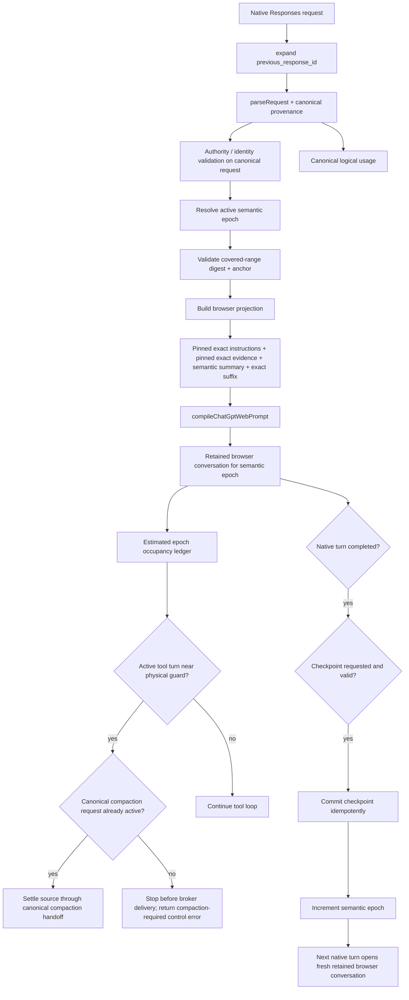

# Semantic Epoch Memory — Implementation Plan for Review

Status: M0–M2 implemented and merged into `main` (see "Status checkpoint 2026-10-08" below); S8 logical window is default-off and awaits an owner decision from in-use logs; S9 not started; S3 and S7 dropped per 5.11
Date: 2026-10-07
Target branch: `feat/semantic-epoch-memory`
Fork: `maemreyo/codex-chatgpt-web`
Upstream: `miuuyy/codex-chatgpt-web`
Upstream baseline: `92a356f` (`v6.1.5`); design originally reviewed against `b6ca2d3` (`v6.1.4`)
Current fork candidate: `fdb15ff` (`feat: scaffold semantic epoch memory safely`), not yet merged with `v6.1.5`
Visibility: hidden, unadvertised, config-file-only experiment (section 5.8). Not a quota or rate-limit feature.

## 1. Review purpose

This document proposes the next implementation slices for keeping a substantially larger native
Codex task history than one ChatGPT browser conversation can safely carry.

The eventual target is approximately **240k logical/canonical Codex context** while keeping every
actual ChatGPT browser working set within the independently measured browser/model transport limit.
The 240k catalog change is explicitly gated on the active-turn physical-pressure and recovery work
in this revision. Inter-turn semantic projection may ship experimentally before that gate, but it
must not advertise 240k by itself.

The central technique is **Semantic Epoch Memory**:

- canonical Responses history remains exact and lossless;
- old, settled task history may be represented to the browser by a Tier 0 masked view with a
  bridge-computed artifact ledger, and, only if measurement requires it, a Tier 1 structured
  checkpoint;
- recent/current evidence remains exact;
- between completed native turns, when the browser working set approaches its physical limit, the
  next turn starts a fresh retained ChatGPT conversation compiled from that view (Tier 1 additionally
  captures a checkpoint on a completed turn first);
- inside one long native tool loop, v1 does **not** rotate semantic epochs. Physical pressure is
  handled by a conservative live guard that either uses an already-active canonical compaction
  handoff or stops before unsafe broker delivery and requires Codex to enter compaction;
- canonical Codex compaction remains a separate mechanism from semantic epoch rotation. Its
  summary inference may use the dedicated Web compactor while preserving the native protocol.

Memory is built in **two tiers** (section 5.10). Tier 0 is a deterministic masked view: old tool
output bodies are replaced by labelled placeholders, and a bridge-computed artifact ledger of files
and commands is carried instead of model recall. It adds no browser submission and cannot fabricate
evidence. Tier 1 is a model-written *structured* checkpoint, used only if the S0.6 measurements show
Tier 0 is insufficient. Published agent studies (section 5.10) found masking roughly equal to LLM
summarization at about half the cost, and free-form summaries harmful; this plan's earlier "semantic
first" position is superseded by that evidence, subject to S0.6 confirming it on this project's own
transcripts and model.

This is a fork-owned, maintainer-of-one project. Upstream's `CONTRIBUTING.md` states that the
project is maintainer-led and that large feature branches and core-behavior changes are generally not
accepted, so no part of this plan depends on upstream merging it. Upstream compatibility is a
rebase-cost concern only (section 21).

## 2. Current verified baseline

The fork is intentionally isolated from upstream:

- `origin` points to `git@github.com:maemreyo/codex-chatgpt-web.git`;
- `upstream` fetches from `https://github.com/miuuyy/codex-chatgpt-web.git`;
- upstream push is disabled;
- `upstream/main` is now `92a356f`, tag `v6.1.5` (was `b6ca2d3` / `v6.1.4` when this plan was
  first reviewed);
- the feature branch is `feat/semantic-epoch-memory`;
- the branch currently contains one fork-only commit, `fdb15ff`, based on `v6.1.4`;
- `git merge-tree` of the branch against `upstream/main` reports no textual conflicts, but see
  section 2.1: a clean textual merge is **not** a clean semantic merge.

The scaffold in `fdb15ff` already does the following without changing the default runtime path:

1. Adds `experimentalSemanticMemory`, default `false`.
2. Propagates the flag to the ChatGPT Web provider config.
3. Forces the flag off in manual/Zero Risk mode.
4. Splits `resolveChatGptWebPhysicalContextLimits()` from
   `resolveChatGptWebContextLimits()`.
5. Keeps `resolveChatGptWebContextLimits()` aliased to the physical resolver for now, so logical
   context behavior has not yet changed.
6. Makes browser input preflight, message budgeting, and multipart physical budgeting use the
   physical resolver explicitly.
7. Adds `docs/SEMANTIC_EPOCH_MEMORY.md` with the core invariants and rollout order.

Verification already completed for that scaffold:

```text
bun run typecheck
git diff --check
bun test tests/runtime-layout.test.ts tests/chatgpt-web-models.test.ts tests/prompt-contract.test.ts tests/chatgpt-web-harness.test.ts
```

Result at `fdb15ff`: 154 tests passed, 0 failed, plus typecheck and diff check passed.

### 2.1 Upstream 6.1.5 reconciliation (reviewed 2026-10-07)

Reviewed `git diff v6.1.4 v6.1.5` (54 files). Only the rows below touch this plan's seams. The
remaining changes (launcher packaging/tests, installer, version, DOM approval-dialog hardening,
tool-refusal prompt wording, subagent-model log line, `suspendForProgress` rename in the worker's
health tracker) have no design impact beyond updating prompt/worker test snapshots at merge time.

| 6.1.5 change | Where | Impact on this plan | Required action |
| --- | --- | --- | --- |
| New `resolveChatGptWebStagingTokenBudget()` for Bigger Context stages; it calls `resolveChatGptWebContextLimits()` | `chatgpt-web-models.ts`, used by `prompt.ts` and `browser-worker.ts` | **Semantic conflict.** Textually clean, but it reads the *logical* seam. Today that aliases physical, so nothing breaks; after S8 diverges the logical resolver, a physical staging/preflight budget would silently follow the logical window and violate invariant 7. | At merge, switch it to `resolveChatGptWebPhysicalContextLimits()`. Add a guard test that every browser enforcement path (preflight, message budget, staging budget, multipart) is insensitive to a diverged logical resolver. |
| Bigger Context staging allocation (low/medium/max efforts), `acknowledgedStages`, `reconcileMultipartHistory()`; Luna/Think error constant | `prompt.ts`, `browser-worker.ts`, `usage.ts` | Multipart changes how a submission maps to turn identities and adds acknowledged stage exchanges to the transcript. Occupancy accounting would have to count stage messages and acknowledgements. | Bigger Context stays **ineligible** for V1 semantic epochs (section 17). Re-read this row before ever making it eligible. |
| `requestRetainedCompactionHandoff()` now passes `compaction: true` to the worker | `compaction-handoff.ts` | The worker distinguishes compaction submissions. S5/S6 compaction views must go through the same flag so recovery/DOM handling stays consistent. | Carry `compaction: true` through any semantic compact view; cover in S6 tests. |
| Terminal `input_too_large` / `last_user_message` rejection detected inside an HTTP 200 SSE stream, in addition to HTTP 413 | `browser-worker.ts` | A new **measured** physical-limit signal, and proof that an "accepted" submission may still be rejected. The occupancy ledger must not treat acceptance as success. | S6: on this signal mark occupancy `at-limit`, record it in diagnostics, never auto-retry with a larger prompt (section 12.2). |
| `thread-environments.json` corruption policy: preserve the damaged file as `*.corrupt-<uuid>`, fail with 409 `thread_environment_state_invalid`, never infer permissions from a damaged cache; `atomicWriteFile(..., { durable: true })` fsyncs | `thread-environment.ts`, `config.ts` | Direct precedent for the S2 checkpoint store. A second, different corruption policy would be a bug. | S2 reuses the same pattern and `durable: true`. Recovery matrix treats a corrupt environment store as an independent fail-closed condition. |
| Response writer is now an observer: `ChatGptObserverDisconnected`, `awaitingRuntime`, heartbeat emit failures detach the observer | `index.ts` | A completed browser answer may never reach Codex. A checkpoint committed for an answer that was not delivered is bound to history that will not exist. | Amend the commit fence (section 11.2): commit only after the completed answer was accepted by the observer; otherwise discard the private tail. |

The review's line-number citations in `SEMANTIC_EPOCH_MEMORY_PLAN_REVIEW.md` refer to `b6ca2d3`;
`index.ts`, `prompt.ts` and `browser-worker.ts` have shifted. This plan cites symbols, not lines.
Re-verify any symbol-level claim at the S0.5 merge before relying on it.

S0.5 status (2026-10-07): merged as `96916aa`. Baseline verification after the merge, run with local
Bun 1.3.5 (the repo pins `packageManager: bun@1.4.0`): typecheck and `git diff --check` clean; 424
tests pass across the 11 affected suites. Four tests in `tests/retained-compaction.test.ts` fail
identically on pristine `v6.1.5` because they call `mock.timers.enable`, which Bun 1.3.5 lacks. They are
an environment mismatch, not a regression from this branch. Use Bun 1.4.0 before treating that file as a
gate.

## 3. Why the current architecture consumes context quickly

There are several different mechanisms that look like “cache” or “history reuse”, but they solve
different problems.

### 3.1 Retained ChatGPT conversations already avoid resending the full prompt each turn

`src/adapters/chatgpt-web/conversation-key.ts` computes a stable retained-conversation key.
`retainedConversationResumeRequest()` then sends only the suffix after the last assistant message.

That reduces repeated browser submissions inside the same retained conversation, but it does not
make the browser conversation forget earlier messages. The physical ChatGPT conversation continues
to accumulate old tool output and old task history.

Therefore suffix-only submission helps transport cost, but it does not create an indefinitely large
working memory.

### 3.2 Sol usage accounting still sees the full canonical history

In `src/adapters/chatgpt-web/index.ts`, `currentUsageInput()` applies the Luna rolling checkpoint only
for Luna. Sol continues to estimate usage against the complete parsed canonical history.

This is intentional in the current design because Codex needs to know when to trigger native
compaction. It also means the logical Codex context and the physical browser context are currently
treated as if they were the same budget.

Semantic Epoch Memory requires these to become two separately measured budgets.

### 3.3 `promptCacheKey` exists in parsed Codex state, but the browser route does not consume it

`CodexRequestOptions.promptCacheKey` is preserved by the parser, and
`extractChatGptTurnIdentity()` can expose the native prompt-cache key. The ChatGPT Web adapter has no
upstream prompt-cache API to bind that key to. The browser route therefore cannot depend on provider
prompt caching as the long-term solution.

The design should treat any external cache hit percentage as orthogonal to browser memory pressure.

### 3.4 `previous_response_id` continuation is currently expanded into full snapshots

`src/responses/state.ts` performs local continuation by expanding a previous response into the next
request. `rememberResponseState()` currently stores:

```text
[...expanded request input, ...response output]
```

for every response in the chain.

For a growing chain this produces approximately quadratic aggregate storage: later entries repeat
most of the same prefix. Existing TTL, count, and byte caps bound the damage but do not fix the
representation.

This is a separate problem from browser semantic memory and should be changed only after the browser
projection path is stable.

### 3.5 Large tool results are the dominant hard case

Tool results can be much larger than ordinary conversation turns. Blindly clipping all large tool
results is unsafe because a large result may contain the one error, path, test result, decision, or
authority statement needed later.

Two rules follow. First, the bridge deterministically protects current evidence and authority.
Second, settled historical output is handled in tiers (section 5.10): mask old bodies while keeping
a bounded, deterministic excerpt for errors and failing results (the one error that matters later),
and only then, if measurement requires it, ask the model for a structured checkpoint. Blind clipping
stays rejected: a masked result always carries its canonical ref, its size, and a visible statement
that the body is omitted.

## 4. Terminology

**Canonical history**
The exact Responses history received from native Codex after local `previous_response_id` expansion.
It is the source of truth for identity, authority, replay, tool pairing, signed reasoning metadata,
and canonical Codex compaction.

**Logical context**
How much canonical history Codex may retain before canonical Codex compaction should be triggered. The target
is roughly 240k tokens, with an auto-compaction threshold below that limit.

**Physical browser context**
What one retained ChatGPT browser conversation can safely carry. This remains controlled by
`resolveChatGptWebPhysicalContextLimits()` and must not be raised merely because logical context is
raised.

**Projected browser history**
The history actually serialized by `compileChatGptWebPrompt()`: one semantic checkpoint plus exact
history since the active epoch anchor.

**Semantic checkpoint (Tier 1)**
Compact assistant-owned task memory generated by the model, in a fixed structured schema (9.1). It
is advisory context, not canonical authority.

**Masked view (Tier 0)**
Browser-facing history in which old tool-result bodies are replaced by deterministic labelled
placeholders (10.4), alongside a bridge-computed artifact ledger. No model call is involved.

**Semantic epoch**
One physical retained ChatGPT conversation whose beginning is a semantic checkpoint. A new epoch
starts when a new checkpoint replaces the older settled browser history.

## 5. Decisions from design review

This revision resolves the six findings in `SEMANTIC_EPOCH_MEMORY_PLAN_REVIEW.md` as architecture
constraints rather than leaving them as open implementation details.

### 5.1 V1 scope: semantic memory is inter-turn; active-turn pressure uses canonical compaction

V1 will **not** attempt semantic epoch rotation while one native Codex turn is still executing tools.
That would require a new same-turn execution/resumption protocol and would widen the most sensitive
session, broker, effect, and idempotency boundaries at the same time as the memory change.

Instead:

- semantic checkpoints are committed only after a completed native turn;
- semantic epoch rotation occurs only before the next native turn starts;
- a long single native turn is protected by a live physical-pressure guard;
- if that guard trips during an ordinary tool-result request, stop before broker delivery and require
  a real canonical compaction request; do not synthesize one inside the bridge;
- if a canonical compaction request already exists with that complete batch, use the existing
  structured settlement/handoff (`settleActiveCompactionSource()` / retained handoff) to finish the
  batch exactly and compact;
- therefore a long single-turn agent may be stopped for compaction below the eventual ~220k logical
  threshold, and seamless continuation depends on the Codex client entering its canonical
  compaction protocol.

Here, "Codex compaction handoff" names the canonical protocol/state transition, not necessarily the
inference backend that writes the summary. Under the experimental dedicated-compactor policy below,
the bridge may execute that summarization through a pinned ChatGPT Web model while preserving the
native Codex compaction request/response semantics.

The ~240k goal means “retain approximately 240k canonical context across completed turns when the
browser working set can be kept small.” It does **not** promise that one uninterrupted tool loop may
consume 240k before native compaction. Same-turn semantic handoff is a possible future v2 project.

### 5.2 Browser projection preserves authority-bearing instructions exactly

Semantic compression may replace settled **evidence/history**, not instruction authority. Any
developer instruction still present in canonical context must stay in the browser projection with
its original role and content unless an existing deterministic supersession rule proves it obsolete.

The same rule applies to selected Codex skill instructions carried at user priority: if they are
still active according to canonical context, they remain exact browser input. They are never
reconstructed from the assistant-written semantic summary.

### 5.3 Recovery is a state machine, not “fallback to canonical”

Once canonical history can exceed the physical browser limit, “just use canonical history” is not a
safe universal fallback. Recovery behavior must explicitly distinguish whether a verified semantic
checkpoint exists, whether canonical input physically fits, and whether a retained source browser
conversation is still available.

### 5.4 Physical pressure uses a live epoch ledger

The compiler estimate for the next projected prompt is not the accumulated occupancy of a retained
ChatGPT conversation. The implementation will track three separate quantities:

1. canonical/logical tokens;
2. next wire message tokens/chars/images/files;
3. conservative **estimated epoch occupancy** across accepted submissions, generated output,
   wrappers, and broker-delivered tool results.

Only the first is reported as logical Codex usage. The third is explicitly an estimate and drives
rotation/active-turn guard policy.

### 5.5 Checkpoints bind the whole covered canonical prefix

Source answer + user revision hashes are insufficient. Every checkpoint is also bound to a stable
fingerprint of the exact canonical input range it replaces.

### 5.6 Semantic quality is a release gate

Reaching 240k without transport failure is not acceptance. The system must also preserve decisions,
avoid repeating ruled-out work, retain required evidence, and behave honestly when exact old
evidence is no longer in the browser working set.

### 5.7 Compaction protocol and compaction inference model are separate decisions

V1 may keep normal task turns on a native Codex model while routing compaction inference to a fixed
ChatGPT Web model. The initial experimental policy is:

```text
normal native turns:        unchanged; for example gpt-6.1-sol
compaction inference:       chatgpt-web/gpt-5.6-sol
compaction reasoning:       medium
default compaction fallback: fail closed
```

This override applies only after the bridge has classified the request as compaction. It must cover
all currently supported Codex compaction entry forms:

- `POST /responses/compact` (remote compaction v1);
- `POST /responses` whose canonical input ends in `compaction_trigger` (remote compaction v2);
- Responses/memento text compaction identified from validated Codex turn metadata.

Classification must happen before the ordinary "non-Web model => native passthrough" branch. The
incoming task model and canonical provenance remain unchanged; only the model/effort used to produce
the compact summary are overridden. A Web compaction failure must not silently fall back to native
inference: a silent change of inference backend makes failures undiagnosable and changes which
account performs the work. Any native fallback must be an explicit opt-in policy with separate
diagnostics.

The dedicated compactor is a **separate, independently default-off setting** from
`experimentalSemanticMemory` (working name `experimentalWebCompactor`). Semantic memory (S1-S4) must
be usable and testable without it, and S5 must not be a prerequisite for S1-S4. It is also the part
of this plan that moves work from one provider backend to another, so it carries the strictest
visibility rule in section 5.8.

This routing rule applies only to a request that is already a canonical Codex compaction request.
Detecting browser pressure inside an ordinary Responses/tool-result turn does **not** itself create a
v1/v2/memento compaction request. V1 must not pretend the existing handoff can promote a normal turn
into compaction; section 12.3 defines the pressure-stop/compaction transition explicitly.

Repository evidence can prove only that a forced Web compaction generated no request to the native
Codex backend. This project makes **no claim** about account-side quota, billing, or rate-limit
semantics, in either direction, in code comments, docs, logs, or UI. Routing tests assert routing,
nothing more.

### 5.8 Hidden, unadvertised, cost-bounded

This is a private experiment, not a product feature. It must not be discoverable or promoted:

- configuration is file-only (`experimentalSemanticMemory`, and the separate compactor setting); no
  launcher Settings control, no `setup` CLI flag or prompt, no `doctor` advertisement, no model
  catalog or model-picker label that mentions it;
- the logical ~240k catalog value applies only when the flag is on; the default catalog is unchanged
  and no shipped display name, description or release note refers to it;
- no mention in `README*`, `TROUBLESHOOTING.md`, `CONTRIBUTING.md`, launcher copy, or release notes.
  The design docs stay under `docs/` and are not linked from any of those;
- wording in docs, comments, log lines and tests describes **context and memory management** only.
  Do not use "quota", "free", "unlimited", or "bypass" language, including in negative marketing
  phrasing. This plan names those words only to prohibit them elsewhere. It matches upstream's own
  rule that the project is not marketed as a quota or rate-limit bypass;
- diagnostics go to the existing local log under a `semantic_*` event family and must never include
  checkpoint text, pinned evidence, or tool output. The privacy-safe Activity export must contain
  counters and identifiers only, because a checkpoint summary is derived from user content;
- the feature must not change behavior of a stock install in any way, including log noise.

### 5.9 Account-cost accounting is a design requirement

Every mechanism here can cause additional work on the user's ChatGPT account: private checkpoint
tails lengthen completions; a rotated epoch resends checkpoint + pins + suffix into a fresh
conversation; Web compaction is a full extra browser submission; Bigger Context multiplies
submissions. None of that is assumed to be free or negligible. Section 14.1 defines the counters, the
baseline comparison, and the caps. A slice is not done until its added submissions/tokens are
measured against the legacy path on the same workload.

### 5.10 Two-tier memory and what published studies say

Evidence consulted 2026-10-07 (read as summaries, not full text; vendor and benchmark caveats below):

- JetBrains Research, "The Complexity Trap" (SWE-agent on SWE-bench Verified, five model
  configurations, repo MIT): hiding old tool observations matched or slightly beat LLM summarization
  and cost about half as much. Summaries ran 13-15% more steps than masking, plausibly because they
  smooth over signs that the agent should stop. A hybrid (masking first, occasional summarization)
  was best.
- "Beyond Token Savings" (arXiv 2609.32961; about 35,000 runs, eight compression primitives): free-form
  summarization lowered success about 11 points; structured summarization raised it 6-8 points;
  policies using a third of the tokens could take 20-80% longer; some policies helped one model and
  hurt another by double-digit points. Results did not transfer across models.
- Factory.ai (vendor benchmark, data and code not released, rubric and judge prompts published):
  probe-based evaluation of recall, artifact trail, continuation, and decision retention scored by an
  LLM judge. Every system scored poorly on file/artifact tracking (about 2.2-2.5 of 5).

What this changes:

1. **Tier 0 first.** Masked view plus bridge-computed artifact ledger. Zero added submissions, zero
   model-written text, therefore no fabricated-evidence risk and no new authority surface. Because a
   retained ChatGPT conversation physically keeps old output, Tier 0 still needs epoch rotation; the
   fresh epoch is simply compiled from the masked view.
2. **Tier 1 is out of V1 (5.11).** A model-written checkpoint returns only if the owner later reverses
   that decision after reading in-use logs. If it ever returns, it uses the structured schema, never
   free-form prose alone.
3. **Artifact trail comes from the bridge, not from model recall.** The bridge holds canonical tool
   calls and can extract files touched, commands run, and test outcomes with refs. This targets the
   one dimension every compression system did worst on.
4. **Stop signals must survive.** Unresolved failures and ruled-out approaches are mandatory fields
   (Tier 1) and failing/error result excerpts are retained (Tier 0), because summaries that hide them
   lengthen runs.
5. **Elongation is a measured cost.** Steps and browser submissions to completion are compared with
   the legacy path (14.1), not only token counts.
6. **Nothing transfers by assumption.** Studies used other models and scaffolds. Every claim above is
   re-measured on this project's Sol path and real transcripts in S0.6 before it drives a build.

Caveats: SWE-bench style agents differ from Codex through a chat-web transport; Factory's numbers are a
vendor's own benchmark; Mem0/Letta conversational-memory benchmarks do not measure coding-agent tool
traces and are services, so they are not used. Reusable assets: the JetBrains repo (strategies, MIT),
Factory's published rubric and judge prompts, and Codex's open-source local compaction handoff prompt
as a starting point for Tier 1 (verify against the Codex source before use).

### 5.11 Scope reduction: observe in real use instead of heavy testing (owner decision, 2026-10-07)

The owner decided that expensive validation is not worth its cost: tests that need many real browser
submissions, a hand-calibrated judge, or long multi-epoch live runs are dropped. Quality is judged by
using the feature and reading logs. This section **supersedes** every conflicting statement elsewhere
in this document.

Dropped:

- the live five-arm S0.6 evaluation, judge calibration, and probe scoring on the real account;
- S7 multi-epoch quality evaluation and the 15.2 corpus run against a real account;
- S8 end-to-end scenarios that need a real account or a real installed Codex (S8 items 4-13 as live
  acceptance), and the pre-written quality/elongation bars that depended on them;
- Tier 1 (the model-written structured checkpoint, S3, 9.1 payload, 11.x capture) from V1. It returns
  only if the owner later decides, from logs and experience, that Tier 0 loses needed information.

Kept, because they are cheap and protect correctness:

- deterministic unit tests: pure masking and ledger functions, digest/provenance, authority
  preservation, store fencing, the physical-resolver isolation test, single-message fit, and the
  rejection-observer tests;
- fake-driven in-process harness tests (the existing `tests/chatgpt-web-harness.test.ts` style) that
  need no account;
- `bun run typecheck`, `git diff --check`, and focused suites per slice; `bun run verify` at a
  milestone only when the owner asks.

Consequences:

- **V1 = Tier 0 only.** Masked view + bridge-computed artifact ledger + inter-turn epoch rotation. No
  model-written memory, so no summary-quality risk and no added browser submission.
- **No pass bar is claimed.** The design rests on published studies (5.10), not on a measured result
  here. Say so wherever behavior is described; do not report quality as verified.
- **The safety net is a kill switch and logs.** The flag stays default-off and is switched off the
  moment behavior looks wrong. Rotation caps and cooldowns (14.1) bound the damage; the in-use log
  schema (14.2) is how the owner decides.
- Because S7 was dropped, V1 uses the smallest non-zero Tier 0 cooldown instead of inventing a
  measured tuning constant: after a reseed, one completed native turn must reuse the current epoch
  before another normal Tier 0 reseed. Model-family invalidation may reseed immediately. Logs can
  justify a different cooldown later.
- **The logical window is not raised on a schedule.** The ~240k catalog value is changed only by the
  owner, by hand, after reading in-use logs for a while. No automated gate stands in for that.
- **M2 (S5, S6) is justified by logs only**: build it when logs show repeated active-turn pressure
  stops, not before.

## 6. Non-negotiable invariants

1. **Canonical history is never destructively rewritten.**
2. **Current native turn input is exact.** No semantic rewrite of the active user revision.
3. **Open tool calls and current tool results are exact.** Tool call/result pairing remains based on
   canonical `call_id` evidence.
4. **Authority reads canonical provenance.** Environment, user-revision, subagent lineage,
   compaction continuation, turn identity, and execution keys continue to use canonical
   `_rawBody`/parsed state.
5. **Active developer and selected-skill instructions remain exact with their original role.** A
   semantic summary cannot inherit or recreate their authority.
6. **Signed/redacted reasoning metadata is never reconstructed from semantic prose.**
7. **Browser enforcement always uses physical limits.** A larger logical window never weakens
   composer, multipart, attachment, or browser preflight.
8. **A checkpoint is advisory task memory plus verified canonical bindings.** Disk state alone is
   never authority.
9. **The checkpoint binds the entire covered canonical range.** Changing an earlier tool result or
   instruction inside that range invalidates it even if the final source answer is unchanged.
10. **Semantic epoch rotation happens only between completed native turns.** V1 never rotates a
    retained browser surface while tools are outstanding.
11. **Active-turn physical pressure never silently becomes compaction.** If the caller has not yet
    issued a canonical compaction request, V1 stops before unsafe tool-result delivery and requires
    a canonical compaction transition; logical 240k is not an override for live browser safety.
12. **Canonical Codex compaction and semantic epoch rotation remain separate identities and state
    machines; the model that writes a compaction summary is an execution-routing choice.**
13. **Recovery never silently relies on lossy oldest-message trimming.** If no trustworthy compact
    browser view can be built, preserve canonical state and return an explicit recovery failure.
14. **Feature-off compatibility applies directly only while canonical history fits the legacy
    physical path.** A thread already grown beyond that budget must be safely compacted before
    downgrade or enter explicit recovery.
15. **Manual/Zero Risk remains unchanged.** Semantic memory stays disabled there until separately
    designed and reviewed.
16. **Hidden by default and by construction.** File-only config, no UI/CLI/doc advertisement, no
    quota-related claims, and zero behavior change for a stock install (section 5.8).
17. **Added account work is measured and capped.** Checkpoint requests, rotations, and Web
    compactions are counted, compared with the legacy path, and bounded by explicit caps; hitting a cap
    degrades to the legacy/compaction path, never to unsafe submission (section 14.1).
18. **No checkpoint or evidence content in logs or exports.** Only counters and identifiers.
19. **Every browser-enforcement path reads the physical resolver.** Preflight, message budget,
    staging budget, and multipart planning are insensitive to the logical resolver, enforced by a test
    rather than by convention (section 2.1).
20. **A placeholder never impersonates content.** A masked result states that its body is omitted,
    carries its canonical ref, size, tool, and outcome, and warns that re-running a tool may not be
    safe. Results of the current native turn, open tool calls, pinned authority, and the exact suffix
    are never masked.

## 7. Target architecture



There are two distinct memory boundaries:

- **semantic epoch boundary:** only between completed native turns;
- **canonical compaction boundary:** may occur inside a long tool task only after Codex has entered a
  real compaction protocol. Browser pressure may require that transition early, but the bridge does
  not synthesize canonical compaction state inside an ordinary response.

The main integration seam remains after canonical parse/authority validation and before browser
prompt construction. However, the physical-pressure guard also integrates at live tool-result
delivery because those results bypass composer preflight.

## 8. Canonical provenance and the projection cut

The review identified that raw Responses input and `parsed.context.messages` are not 1:1. Reasoning
can merge into assistant state, tool-search/additional-tool records do not necessarily become parsed
messages, and parsed messages do not preserve every native `turn_id` boundary.

The implementation must therefore avoid this invalid rule:

```text
find raw anchor index -> slice parsed.messages at the same numeric index
```

### 8.1 Add a private provenance sidecar

Additive parser/runtime metadata should map browser-visible parsed messages back to the canonical
raw item identities that produced them. The exact type can evolve, but it must support:

- one raw item -> zero parsed messages;
- one raw item -> one parsed message;
- multiple raw items -> one parsed assistant message;
- explicit canonical ordering;
- exact native turn/source identity where available.

Tentative shape:

```ts
interface CodexMessageProvenance {
  messageIndex: number;
  sourceItemRefs: string[];
}
```

`sourceItemRef` is a bridge-derived stable digest/reference, not a parser timestamp or array index.
The canonical `CodexParsedRequest` remains untouched semantically; this is private provenance used
only to construct and validate browser projections.

Tests must cover reasoning envelopes, tool calls/results, tool search/additional tools, duplicate
assistant text, delegated agent messages, and previous-response replay.

### 8.2 Stable canonical item digest

Define one versioned canonicalization function for semantic-memory hashing. It should hash the exact
ordered canonical source items after `previous_response_id` expansion using deterministic JSON
canonicalization. It must not include parser-generated timestamps or process-local object identity.

The digest policy itself is versioned so a future normalization change invalidates old checkpoints
rather than accidentally reusing them.

## 9. Semantic checkpoint and exact evidence pins

Tier 0 needs no model-written content. Where a Tier 1 checkpoint exists it is structured, and v1 also
needs a narrow exact-evidence mechanism so “important raw evidence” is not reduced to prose only.

### 9.1 Payload

Tier 1 only (conditional on S0.6). The payload is structured; free-form prose is not accepted as the
sole content because the 2609.32961 study found free-form summaries reduced success.

```ts
interface ChatGptSemanticCheckpointPayloadV1 {
  version: 1;
  objective: string;                       // active user intent
  decisions: Array<{ text: string; status: "active" | "superseded" }>;
  ruledOut: string[];                      // approaches tried and why they failed
  unresolved: string[];                    // failures/blockers; mandatory, may be empty only explicitly
  nextActions: string[];
  notes: string;                           // bounded; remaining task state
  pinRefs: string[];
}
```

Each field has a token cap; the checkpoint is updated *iteratively* (merge new settled content into the
prior payload) rather than regenerated from scratch, so earlier decisions are not silently lost. The
bridge-computed `artifactLedger` (9.2) is **not** part of the model-written payload. `pinRefs` lets the
model nominate a bounded set of immutable canonical message/tool evidence references that must be
rehydrated exactly in the next epoch.

The bridge validates every `pinRef`; the model cannot invent a ref. Developer instructions and
active skill instructions are pinned by policy and do not consume this model-selected evidence
mechanism.

The private checkpoint prompt should preserve, mapped onto the fields above:

- active objective and user intent;
- accepted and superseded decisions;
- exact paths, identifiers, commands, commits, versions, and external references;
- completed work and test evidence;
- failures and hypotheses they ruled out;
- unresolved blockers and next useful actions;
- references to exact evidence needed later.

It must exclude hidden chain-of-thought, credentials, capability tokens, and transport secrets.

### 9.2 Bridge-owned epoch record

```ts
interface StoredChatGptSemanticEpochV1 {
  version: 1;
  projectionPolicyVersion: 1;
  digestPolicyVersion: 1;
  threadId: string;
  semanticEpoch: number;
  sourceTurnId: string;
  sourceAnswerHash: string;
  sourceUserRevisionHash: string;
  coveredThroughRef: string;
  coveredHistoryDigest: string;
  modelFamily: string;
  tier: 0 | 1;
  maskingPolicyVersion: 1;
  artifactLedger: ChatGptArtifactLedgerV1;        // bridge-computed from canonical tool calls
  checkpoint?: ChatGptSemanticCheckpointPayloadV1; // present only for tier 1
  updatedAt: number;
}

interface ChatGptArtifactLedgerV1 {
  filesTouched: Array<{ path: string; op: "read" | "write" | "delete" | "unknown"; ref: string }>;
  commands: Array<{ commandDigest: string; exit?: number; failed: boolean; ref: string }>;
  testOutcomes: Array<{ ref: string; failed: boolean; excerptRef?: string }>;
}
```

The ledger is derived deterministically from canonical tool calls and results within the covered range.
It holds paths, outcomes and refs, never output bodies. Extraction rules are versioned
(`maskingPolicyVersion`); tool calls the extractor cannot classify are recorded as `unknown`, never
guessed. Anything shell-derived is labelled as extracted from a command string, not verified state.

`coveredHistoryDigest` fingerprints the complete canonical prefix replaced by the checkpoint,
including older tool evidence and instruction records. `coveredThroughRef` gives the cut an immutable
identity independent of raw array position.

Validation must reject a checkpoint when any covered canonical item changes, even if the source
turn answer and source user revision still match.

### 9.3 Persistence and commit fencing

Use a dedicated versioned state file such as:

```text
<config-dir>/runtime/semantic-epochs.json
```

Add an internal provider path for tests:

```ts
semanticCheckpointStatePath?: string;
```

Commit is idempotent on source identity + covered digest. A delayed completion from an older browser
execution must never overwrite a newer epoch. Atomic file writes are necessary but insufficient;
the store needs compare-before-commit semantics against the currently active epoch/source.

Follow the corruption policy upstream introduced for `thread-environments.json` in 6.1.5 rather than
inventing a second one: write through `atomicWriteFile(path, data, { durable: true })`; on invalid
JSON preserve the original as `<file>.corrupt-<uuid>` and treat the store as empty only on a path
that has independently verified canonical authority; on an unsupported schema or invalid records fail
with an explicit non-overwriting error. A damaged semantic store never lets the bridge infer
authority, and "treat as empty" is never the same as "treat occupancy as zero".

## 10. Browser projection contract

### 10.1 Project only replaceable settled evidence

A projected browser view consists of four classes, in authority-safe order:

1. exact `systemPrompt`;
2. exact pinned authority-bearing messages that remain active, preserving role/content and their
   canonical relative order;
3. the Tier 0 masked view with its artifact ledger (10.4) and, when a Tier 1 checkpoint exists, the
   checkpoint plus exact rehydrated `pinRefs`;
4. exact canonical suffix after the covered cut.

The suffix includes the current native turn and every active/open tool call/result exactly.

Pinned authority-bearing messages include at minimum:

- canonical developer messages still active under deterministic supersession rules;
- selected Codex skill instructions still active in canonical context;
- any future message class explicitly declared non-compressible by the projection policy.

Do not infer authority from text. A tool result containing text that looks like a developer
instruction remains a tool result.

### 10.2 Build the browser context from provenance, not array-index assumptions

The projector should select exact messages through the provenance sidecar. If implementation is
simpler, it may construct a synthetic browser-only Responses body from selected canonical raw items,
parse that body, and transplant only its browser-visible `context` into a clone. In either case:

- canonical `_rawBody` used by authority/identity remains original;
- the synthetic/projected body is never used for environment authority, execution keys, user
  revision validation, subagent lineage, or tool settlement;
- duplicate pinned messages already present in the exact suffix are de-duplicated by canonical ref,
  not by matching text.

### 10.3 Apply validation

For a normal supported Sol turn:

1. resolve canonical thread/turn identity;
2. load the active epoch;
3. verify schema/policy/model eligibility;
4. locate `coveredThroughRef` in canonical history;
5. recompute `coveredHistoryDigest`;
6. verify source answer and source user-revision hashes;
7. resolve all exact policy pins and model-selected `pinRefs`;
8. prove the current suffix starts strictly after the covered cut;
9. build browser context from pins + checkpoint + exact suffix;
10. preflight the selected next wire message against physical limits.

If validation fails, enter the recovery state machine in section 13. Do not blindly substitute the
full canonical prompt when it no longer fits.

### 10.4 Tier 0 masking policy

The masked view replaces the *body* of an old, settled tool result; calls, user messages, assistant
messages, and pinned authority stay exact. A masked result renders as one deterministic line:

```text
[tool result omitted: tool=<name> ref=<canonical ref> size=<tokens> outcome=<ok|error|exit N>
 excerpt=<bounded head/tail for error or failing results, else none>.
 The body is not in view. Re-running a tool may not be safe or idempotent.]
```

Rules:

- never mask: results of the current native turn, results for open/outstanding calls, the exact
  suffix after the cut, and any pinned authority-bearing message (invariants 3, 5, 20);
- keep a bounded deterministic excerpt (head and tail, fixed caps) for results marked error, non-zero
  exit, or recognized failing test output, so a stop signal is not hidden;
- the masking window (how many recent settled results stay exact) is a tunable measured in S0.6/S7,
  not a guessed constant;
- placeholders never include model-written text; the line is a pure function of the canonical item;
- the ledger (9.2) is rendered as a compact section ahead of the exact suffix and labelled as
  bridge-extracted, not as verified current repository state;
- if the masked view alone still exceeds the single-message budget (12.4), shrink the window first,
  then fall to Tier 1 or the legacy/compaction path; exact suffix and authority are never trimmed.

## 11. Checkpoint capture and epoch rotation

### 11.1 Capture uses the normal completed turn

Do not add a separate summarization turn after every tool call. On a turn selected for checkpointing,
the normal visible model completion appends one private semantic tail. The worker strips that tail,
validates it, and exposes it to the adapter only after the browser outcome is complete.

`BrowserTurn`/worker plumbing must be extended deliberately; the current private-tail capture is
Luna-specific, so changes are required in the actual stream/worker path, not only `prompt.ts` and
`index.ts`.

**Tier 0 needs no capture.** A Tier 0 epoch is built entirely by the bridge from canonical history at
rotation time (10.4); it adds no tail and no submission. Everything below in 11.1-11.3 concerns Tier 1
only and is **out of V1 scope** (5.11). Rotation to a Tier 0 epoch still follows 11.3's
boundary rules (between completed native turns, never with outstanding tools).

**Which turns request a checkpoint (Tier 1).** The tail lengthens a normal completion, so it is the
main cost lever (section 14.1) and is not requested every turn. A turn requests a checkpoint only when
all of these hold:

- the thread is eligible (section 17) and the flag is on;
- `estimatedEpochOccupancy` for the current epoch is at or above a **rotation threshold** that is
  deliberately below the active-turn guard threshold of section 12.3, with enough headroom left in
  the epoch to emit the tail;
- there is no unexpired/valid checkpoint already covering the same cut;
- the per-thread checkpoint cap and cooldown from section 14.1 have not been hit.

A turn that does not request a checkpoint is byte-for-byte the legacy prompt.

### 11.2 Commit fence

Commit only after all of these are true:

- the completed answer was accepted by the response observer. Since 6.1.5 a writer failure detaches
  the observer (`ChatGptObserverDisconnected`) and aborts the turn; an answer Codex never received
  will not appear in canonical history, so its private tail is discarded, not committed;
- the native response is a final completed answer, not a tool-call round;
- no tool request remains outstanding;
- the visible answer passed existing output/structured-output validation;
- the private marker appeared exactly once and never leaked to visible output;
- payload token/ref bounds validate;
- all `pinRefs` resolve inside the covered canonical range;
- source answer, source revision, and covered digest can be bound to the completed canonical turn;
- compare-before-commit proves this source is not older than the store's active epoch.

### 11.3 Rotation

After a valid checkpoint for completed turn `T` is committed:

1. increment `semanticEpoch`;
2. leave canonical request/response untouched;
3. on native turn `T+1`, use the new projection;
4. include semantic epoch in retained-conversation identity;
5. start a fresh retained browser conversation;
6. within that epoch, keep existing suffix-only retained-chat behavior.

V1 never rotates at a tool boundary inside `T`.

## 12. Physical accounting and active-turn guard

### 12.1 Three measurements

Maintain these separately:

**Canonical logical tokens**
Estimated from full canonical history. This is what Codex sees for logical context/auto-compaction.

**Next wire message budget**
Exact/best-available estimate for the next composer message: tokens, chars, images, skill files, and
multipart stages. Existing browser preflight remains authoritative for this dimension.

**Estimated epoch occupancy**
A conservative ledger for the retained browser conversation. It includes at least:

- accepted submitted prompt/stage wrappers;
- generated assistant text/reasoning that remains in the transcript;
- tool call representation;
- tool results delivered through the broker;
- private checkpoint tail emitted before stripping from outer Codex output;
- fixed safety reserve for product/connector formatting that the bridge cannot count exactly.

Call this field `estimatedEpochOccupancy`; do not present it as provider-reported usage.

### 12.2 Idempotent ledger updates

Ledger events need stable identities so reconnect/replay cannot double-count. Use existing execution,
round, call, and submission identities where possible. At minimum:

- an accepted wire submission is counted once;
- a tool result `call_id` is counted once when delivered to the broker/browser;
- replaying journaled Responses events does not add occupancy;
- reconnecting to the same retained execution does not reset occupancy to zero.

If restart/reconnect cannot reconstruct occupancy with confidence, mark it unknown. Unknown occupancy
forces conservative behavior: rotate at the next completed safe boundary, or stop before another
large active-turn delivery unless a canonical compaction request is already active.

Acceptance of a submission is not proof the epoch can carry it. Since 6.1.5 the worker also detects
a terminal `input_too_large` / `last_user_message` rejection delivered inside an HTTP 200 SSE
stream, in addition to HTTP 413. Either rejection is a measured physical-limit observation: set the
ledger for that epoch to `at-limit`, record it under `semantic_*` diagnostics, and let it drive
rotation or the pressure stop. It must never trigger an automatic resubmission with a larger or
differently truncated prompt. It is also the only direct calibration signal available for the
reserve and thresholds, so S6/S8 harness runs should log it with the ledger value at that moment.

### 12.3 Guard at live tool-result delivery

Tool results bypass composer preflight, so the guard must run before the adapter loops over
`broker.completeTool()`.

Conceptually:

```text
estimated occupancy
+ exact incoming batch estimate
+ output/checkpoint reserve
>= physical guard threshold
```

If false, deliver the batch normally.

If true, behavior depends on the **current canonical request kind**.

#### 12.3.1 Pressure while canonical compaction is already active

When the incoming request is already classified as v1/v2/memento compaction and its canonical input
contains the complete outstanding tool-result batch, use the existing active-compaction settlement
path. Under one exclusive session fence:

1. prove the batch matches every outstanding `call_id` exactly once;
2. request compaction on the broker;
3. deliver the complete canonical batch exactly once;
4. mark every result delivered only after broker acceptance;
5. settle the old browser response;
6. perform the retained structured handoff or semantic compact view;
7. route summary inference through the dedicated Web compactor;
8. return the protocol-specific canonical compaction response to Codex;
9. allow the later normal request to resume from Codex's installed compacted history.

This is the valid use of `settleActiveCompactionSource()`: a real canonical compaction request
already exists before the bridge starts the handoff.

#### 12.3.2 Pressure discovered in an ordinary tool-result request

The current code has no operation that promotes an ordinary Responses request into canonical
compaction. V1 therefore fails closed **before** the normal loop calls `broker.completeTool()`:

1. acquire the same per-session/execution fence used to prevent duplicate settlement;
2. validate and hash the complete incoming result batch, but do not deliver it to the browser;
3. keep the browser session and outstanding-call state unchanged;
4. return a distinct non-retry-looping control failure such as
   `chatgpt_active_turn_compaction_required`, including canonical thread/turn/round identity and the
   measured pressure reason in diagnostics;
5. accept later progress only after Codex issues a canonical compaction request carrying the same
   canonical result batch; that request then follows 12.3.1.

Blindly retrying the same ordinary request must reproduce the same pressure result and must not
start delivering the batch. The bridge must not synthesize `compaction_trigger`, mutate outer Codex
history, or install a hidden compacted history on behalf of the client.

If the current Codex client does not react to this control failure by initiating canonical
compaction, the outcome is an explicit bounded failure rather than unsafe continuation. Seamless
pressure-initiated compaction requires a separately proven Codex client/control contract and is not
a hidden assumption of the 240k work.

The guard threshold is derived from the measured physical mode budget and a fixed reserve, not a
hard-coded 95k or an unproven 70-80% percentage. Harness measurements choose the final reserve.

If one atomic current tool result cannot fit even under the handoff path, return the existing
explicit oversize/recovery error; semantic memory does not truncate active evidence.

### 12.4 Single-message "too long" rejections

A ChatGPT browser submission can be rejected as too long even when the context window looks fine.
This is a different failure from epoch occupancy, it already happens today, and this feature must not
make it more frequent. Current handling in the code is:

- **Prevention (pre-send):** `assertChatGptWebInputWithinLimits()` checks the composer character
  limit, the Pro per-message token limit, and the estimated input against the context window. Token
  counting uses the real `o200k_base` tokenizer. The message budget subtracts a **fixed** hidden
  reserve (`CHATGPT_WEB_PLATFORM_RESERVE_TOKENS`, 8,192). Plus accounts have a character limit but no
  measured per-message token limit.
- **Detection (post-send):** `ChatGptSubmissionRejectionObserver` recognizes HTTP 413
  `message_length_exceeds_limit`; 6.1.5 adds the terminal `input_too_large` /
  `last_user_message` error inside an HTTP 200 SSE stream.
- **Outcome:** a non-retryable `context_length_exceeded` error whose message tells the user to
  compact. Nothing records which size was rejected, and nothing prevents the same size being sent
  again on the next turn.

Distinct causes this plan must keep separate, because they need different remedies:

| Class | Example | Why preflight misses it |
| --- | --- | --- |
| A. Hidden overhead exceeds the fixed reserve | Large custom instructions, memory, or many connectors on this account | The reserve is a constant, not measured per account/mode |
| B. Accepted, then rejected on the next send | Bigger Context stages near the Instant maximum (upstream #777, fixed by 6.1.5 staging allocation) | Each message passes alone; the accumulated conversation does not |
| C. First message of a new epoch is too large | Checkpoint + pins + exact suffix compiled into one message | The single-message budget is not part of the rotation decision |
| D. Retained epoch near its limit | A small next message into a conversation that is already full | Preflight sees only the new message (section 12.1) |

Requirements:

1. **Rotation must prove the new epoch's first message fits.** Before committing a rotation, compile
   the projection and check it against the single-message character/token budget for the selected
   mode, *minus* reserve for the model's reply and the checkpoint tail. If it does not fit, do not
   rotate. Shrink model-selected `pinRefs` first, then fail to the legacy/compaction path; exact
   suffix, developer instructions, and active tool evidence are never trimmed to make it fit
   (invariants 2, 3, 5).
2. **A rejection is a calibration event, not just an error.** On any 413 or SSE `input_too_large`,
   record `{mode, effort, accountTier, estimatedMessageTokens, messageChars, ledgerValue, rejectionKind}`
   as counters/identifiers only (invariant 18). Persist a per-account/mode **observed ceiling** equal to
   the smallest rejected estimate minus a safety margin. The effective message budget becomes
   `min(static budget, observed ceiling)`. It can only tighten automatically, never loosen; loosening
   is a deliberate edit. This directly turns class A into a self-correcting case.
3. **The same payload is never resent after a size rejection.** The retained conversation's state after
   a rejected submission is uncertain, so mark its occupancy `at-limit`, rotate or require canonical
   compaction at the next safe boundary, and surface a precise error naming the class when known. It
   is not an automatic retry.
4. **Class B must be covered for any future multipart eligibility.** A stage budget that is valid for
   one message is not valid for a sequence. The 6.1.5 staging allocation is the reference; the ledger
   counts every stage message and acknowledgement.
5. **Compaction views obey the same single-message bound.** A semantic compact view (13.1) is sized by
   construction to fit one message for the selected mode. The legacy oldest-message trimming remains
   only for the legacy path (invariant 13).
6. **Diagnosability.** The rejection log line (also on the legacy path, because it only fires on a
   failure) includes the estimated tokens and chars next to the rejected limit, so the next occurrence
   of "message too long" can be classified A/B/C/D from a safe export without reading content. This is
   a small, independent fix and should be done as its own change (S0.5b), not bundled into the
   semantic work.

## 13. Recovery and canonical compaction state machine

The recovery decision is made before browser prompt construction or unsafe tool-result delivery.

| Semantic checkpoint | Canonical fits physical browser | Source state | Required action |
| --- | --- | --- | --- |
| valid | either | any | use verified semantic projection / semantic compact view |
| missing/invalid | yes | any | use canonical legacy browser view; seed a new checkpoint later |
| missing/invalid | no | exact live `ChatGptTurnSession` is provable in this process | retained handoff may use that exact session/key |
| missing/invalid | no | restart / no independently proven locator | fail closed with explicit semantic-memory recovery error; preserve canonical history |

### 13.1 Dedicated browser view for Codex compaction

An `_compactionRequest` must not automatically bypass semantic projection once canonical history can
exceed the physical limit.

When a verified epoch exists, compile the browser view for canonical compaction from:

```text
exact active system/developer/skill instructions
+ verified semantic checkpoint
+ exact evidence pins
+ exact canonical suffix after covered cut
+ exact canonical compaction instruction
```

The output remains the normal canonical Codex compaction summary/response shape required by the
specific protocol. The semantic checkpoint is only a browser input optimization.

The current inline oldest-message trimming path is not accepted as memory-preserving recovery for a
large semantic thread. It may remain for legacy/small-history behavior where existing tests require
it, but semantic mode must not claim successful recovery merely because trimming produced a prompt
that fits.

### 13.2 Dedicated compaction inference routing

Compaction routing is classified before ordinary model passthrough. The implementation should use a
single helper that recognizes all supported compaction forms from the decoded request plus validated
Codex metadata, and returns an explicit compaction protocol kind such as `v1`, `v2`, or `memento`.

When experimental semantic memory enables the dedicated compactor, that classification selects a
pinned automatic Web route equivalent to:

```text
model family: GPT-5.6 Sol Web
reasoning:    medium
tools:        disabled for compaction
fallback:     error / fail closed
```

Do not mutate canonical task identity to pretend the native task itself changed model. Preserve the
incoming model, thread/turn metadata, source revision, compaction response format, and canonical
history for authorization/replay. Only the browser-facing compaction execution route is overridden.

Protocol-specific output stays unchanged:

- v1 returns the bounded replacement `output` built from the Web-written summary;
- v2 returns exactly one bridge-owned `compaction` item and preserves the existing transparent
  `ocx1:` continuation contract;
- memento returns the assistant-text compaction shape expected by the native client.

When a later normal turn returns to a native model, keep `scrubBridgeArtifactsForNative()` for
bridge-owned `ocx1:`/reasoning artifacts, but do not treat that helper as sufficient for
`previous_response_id`. Local continuation state must be resolved before provider routing as defined
below.

The first implementation may expose an internal experimental setting for the dedicated compactor,
but V1 acceptance pins the route to GPT-5.6 Sol Web Medium so tuning does not silently change the
compaction model. Any future native fallback must be an explicit policy value rather than an
automatic retry.

#### 13.2.1 Resolve local `previous_response_id` before provider routing

Current `responseRequest()` can short-circuit a non-Web model to native passthrough before
`expandPreviousResponseInput()` runs. That is unsafe when the request contains only a delta plus a
`previous_response_id` created by the local Web bridge: the native backend never created that ID.

S5 must introduce a pre-routing continuation resolver with an explicit result, conceptually:

```ts
resolvePreviousResponseInput(raw): {
  body: unknown;
  expandedFromLocal: boolean;
  localPreviousResponseId?: string;
}
```

Required behavior:

1. run immediately after JSON/body validation and before the non-Web passthrough branch;
2. if the ID is unknown to the local continuation store, leave body and ID unchanged so a real
   native `previous_response_id` still reaches native Codex normally;
3. if the ID is local, expand the complete canonical input before model/provider routing;
4. when the selected destination is native, remove that local `previous_response_id`
   unconditionally, even if expanded input contains no `ocx1:` or bridge reasoning item;
5. then run `scrubBridgeArtifactsForNative()` on the expanded body to decode/remove other Web-local
   artifacts and provider-local IDs;
6. classify v1/v2/memento compaction from the normalized canonical body, not from a delta-only view;
7. preserve replay-prefix metadata needed by parser/authority code for the expanded body.

The native forward path must build its request from this normalized body whenever local expansion
occurred; it must not reuse the original raw `Request` clone in that case.

### 13.3 Restart and missing state

After restart, persisted semantic state is revalidated against canonical history. If the checkpoint
file is missing or stale and canonical history is already above physical budget, V1 does **not**
assume that a physically retained browser conversation is recoverable. The current retained-source
locator is process-local (`conversationHeads` / `ChatGptTurnSession`), while semantic epoch identity
is part of the retained key. After restart plus lost/corrupt semantic state there is no independently
proven locator.

V1 recovery is therefore:

- same process + exact live source session proven: retained handoff may be used;
- restart + semantic checkpoint valid: reconstruct the epoch normally from persisted semantic state;
- restart + semantic checkpoint missing/invalid + canonical fits: fall back canonically;
- restart + semantic checkpoint missing/invalid + canonical oversized: fail closed with a distinct
  non-retry-looping recovery error, even if the launcher may still physically hold an unknown chat.

A future enhancement may persist a separately fenced retained-epoch locator and add a worker-level
"resume by proven conversation key" handoff. That is outside V1 unless implemented and tested before
S8. V1 must not scan or guess launcher conversations by thread text or hash prefixes.

### 13.4 Rollback / disabling the feature

For a thread whose canonical history still fits the legacy physical path, disabling the flag returns
directly to legacy behavior.

For a thread already above that budget, the supported downgrade procedure is:

1. keep semantic mode enabled long enough to produce a safe canonical Codex compaction, using the
   dedicated Web compactor when configured;
2. verify the resulting canonical history fits the legacy path;
3. disable `experimentalSemanticMemory`;
4. retain the semantic state file as inert data or delete it later through a separate maintenance
   action.

If the feature is disabled first on an oversized thread, detect that state and return an explicit
recovery requirement rather than attempting legacy submission.

## 14. Usage reporting and the guarded 240k target

Externally reported Responses/Codex usage remains based on **canonical logical history**. Do not
report the smaller semantic projection as logical usage; doing so would hide real retained history
and postpone canonical compaction indefinitely.

Internal diagnostics for experimental mode should report, separately:

```text
canonicalLogicalTokens
nextWireMessageTokens / chars / attachment reserve
estimatedEpochOccupancy
physicalContextLimit
semanticEpoch
occupancyConfidence = known | reconstructed | unknown
```

Only after projection, live occupancy guarding, the reviewed active-turn pressure transition,
recovery compact view, and semantic quality evaluation all pass may
`resolveChatGptWebContextLimits()` diverge from the physical resolver.

First experimental target:

```text
logical context window:      ~240,000 tokens
logical auto-compact target: ~220,000 tokens
physical browser limits:     unchanged and mode-specific
active single-turn pressure: may require canonical compaction or fail closed earlier than 220k
```

The target may remain tunable behind the experimental flag during DEV acceptance. No physical
composer, multipart, attachment, or browser limit is raised by this project.

### 14.1 Account-cost accounting and caps

Counters are kept per thread and per process, written to the local log as `semantic_cost` events and
exported only as numbers (invariant 18):

```text
checkpointTailRequests        turns that carried a private checkpoint tail
checkpointTailTokensEst       estimated extra generated tokens for those tails
epochRotations                committed rotations
reseedInputTokensEst          tokens in the first message of each new epoch (checkpoint + pins + suffix)
webCompactionSubmissions      browser submissions made on behalf of canonical compaction
extraStageSubmissions         multipart stage messages (stays 0 while Bigger Context is ineligible)
physicalRejections            413 / SSE input_too_large observations
maskedResults / maskedTokensEst  Tier 0 placeholders emitted and tokens they replaced
stepsToCompletion / extraCalls   native steps and browser submissions needed vs the legacy replay,
                                 so trajectory elongation is measured, not assumed
discardedTails                tails dropped by the commit fence
legacyEquivalentSubmissions   what the legacy path would have submitted for the same native turns
```

The headline metric is **extra browser submissions and extra estimated tokens per 100 native turns
relative to legacy** on the same workload. `legacyEquivalentSubmissions` is computed, not measured
live, by replaying the same canonical request sequence through the legacy compile path in the DEV
harness.

Caps, all with conservative defaults chosen from the S7 measurements rather than guessed here:

- at most N checkpoint tail requests per thread per rolling hour, and a minimum number of native
  turns between two rotations (cooldown), so a thread hovering at the threshold cannot rotate every
  turn;
- at most M Web compaction submissions per thread per rolling hour;
- a cap hit **degrades**: no checkpoint requested, no rotation, and the legacy/canonical-compaction
  path applies. If canonical history does not fit the physical limit, the recovery state machine of
  section 13 applies. A cap never causes an oversized submission.

Acceptance requires the measured extra-work ratio to be written down before S8 and the DEV account
spend of the evaluation itself (S0.6/S7 are real submissions) to be recorded, not assumed free.

### 14.2 In-use log schema and report

All events go to the existing local log (daemon stdout, so they land in `launcher.jsonl`) as one
JSON object per line with the prefix `semantic_`. A stock install emits none. Content is never logged
(invariant 18); identifiers are hashed thread/epoch ids and canonical refs.

| Event | Fields |
| --- | --- |
| `semantic_turn` | threadHash, epoch, tier, canonicalTokens, nextWireTokens, estimatedEpochOccupancy, occupancyConfidence, physicalLimit |
| `semantic_rotation` | threadHash, fromEpoch, toEpoch, reason, firstMessageTokens, firstMessageChars, fitsSingleMessage, maskedResults, maskedTokensEst, ledgerFiles, ledgerCommands, windowSize |
| `semantic_skip` | threadHash, reason (`ineligible`, `no_fit`, `cooldown`, `cap_hit`, `outstanding_tools`, `unknown_occupancy`) |
| `semantic_validation_failed` | threadHash, reason (`digest_mismatch`, `anchor_missing`, `schema`, `corrupt_store`), fellBackTo |
| `semantic_reject` | threadHash, kind (`http_413`, `sse_input_too_large`), mode, effort, estimatedMessageTokens, messageChars, ledgerValue, class (A/B/C/D when known) |
| `semantic_fallback` | threadHash, to (`legacy`, `compaction_required`, `recovery_error`), reason |

Add a read-only script, `scripts/semantic-log-report.ts`, that reads a `launcher.jsonl` path given on
the command line and prints counts and simple ratios: rotations per thread, masked tokens saved, skips
by reason, rejections by class and whether any occurred after a rotation, fallbacks, retained-chat
size rejections by thread, and observed turns per semantic epoch. The current event schema cannot
measure native steps per turn; do not label turns per epoch as steps per turn or infer elongation from
them. Only fixed enum values and validated hashed thread IDs are reported. It makes no network or
model call and prints no content. This report is the owner's acceptance tool.

Optional local trace (default off, own flag, name `experimentalSemanticMemoryTrace`): writes the exact
masked view that was sent to a mode-0600 file under `<config-dir>/diagnostics/semantic-trace/`, with a
short TTL and a size cap, so the owner can read what the model actually saw when something looks
wrong. It is the only place content may be written, it never goes to `launcher.jsonl`, and it is
excluded from the safe export. It stays off unless the owner turns it on.

## 15. Semantic quality and evidence policy

### 15.1 Exact evidence rehydration policy

V1 does not expose an arbitrary “query all canonical history” tool to the browser model. Instead it
uses bounded exact evidence pins:

- authority-bearing instructions are pinned by bridge policy;
- the checkpoint may nominate validated immutable `pinRefs`;
- pinned canonical evidence is reinserted exactly into the next epoch;
- the remainder of covered settled history is represented only by semantic summary.

If the model later needs an exact historical fact that is neither in the exact suffix nor an exact
pin, it must not invent exact evidence. The semantic prompt contract should require it to distinguish
remembered task state from directly available exact evidence.

On-demand canonical retrieval may be evaluated later, but it is not required to prove v1.

### 15.2 Quality eval workload

Before raising the logical window, run multi-epoch tasks containing at least:

- a fact introduced early and needed much later;
- a developer instruction established before the first semantic cut;
- selected skill instructions across rotation;
- a decision later superseded by a newer decision;
- a failed approach that must not be repeated;
- conflicting test results where the newer result wins;
- an unresolved blocker that must survive multiple epochs;
- exact path/commit/command evidence pinned for later citation;
- a large irrelevant tool result that should disappear from browser working memory;
- at least three semantic epoch rotations.

Use the S0.6 probe categories (recall, artifact, continuation, decision) and judge. Compare against a
full-context baseline on:

1. next action correctness;
2. decision/supersession recall;
3. failure avoidance;
4. exact evidence recall for pinned items;
5. unsupported exact-claim rate for unpinned history;
6. task completion quality;
7. trajectory elongation: native steps and browser submissions to completion versus the baseline
   (14.1). Memory that scores well but makes tasks take materially longer is a failure.

The acceptance threshold must be written down before the 240k catalog change. At minimum, no
authority violation, no repeated known-destructive/invalid action caused by forgotten state, and no
fabricated exact evidence are allowed. Aggregate task-quality tolerance can then be tuned from the
baseline corpus.

## 16. Retained conversation identity

Extend `chatGptConversationKey()` with an explicit semantic epoch input rather than hiding semantic
state inside parser data:

```ts
chatGptConversationKey(parsed, namespace, { semanticEpoch })
```

Requirements:

- feature disabled: legacy key remains unchanged;
- same semantic epoch: same retained key;
- semantic epoch increment: deterministic new key;
- native compaction epoch remains a separate hash dimension;
- fresh-conversation-per-turn mode is initially ineligible for semantic retained epochs unless a
  dedicated compatibility test proves value;
- delayed completion from an older epoch cannot reclaim the active key or overwrite newer state.

## 17. Eligibility and compatibility matrix

V1 should start narrow rather than treating `experimentalSemanticMemory=true` as proof that every
route supports the feature.

Initial recommended eligibility:

| Mode/feature | V1 semantic epochs |
| --- | --- |
| Sol, automatic, Full/local-tools, retained launcher | eligible first |
| Sol read-only retained browser | eligible after prompt/rotation tests |
| Luna | no; keep Luna rolling checkpoint implementation |
| Manual / Zero Risk | no |
| Fresh Conversation Per Turn | no initially |
| Bigger Context | no in V1. 6.1.5 changed staging allocation and added acknowledged-stage reconciliation (section 2.1); occupancy and identity rules for multipart are unresolved |
| Skill Attachments | yes only with exact selected-skill pinning tests |
| Saved chats vs Temporary Chat | both require retained-key/recovery tests |
| Managed Chrome | enable only after same lifecycle/reconnect evidence as launcher |
| Model switch inside thread | invalidate/reseed unless model-family policy explicitly allows reuse |
| Native task model + dedicated Web compactor | eligible only after S6 cross-provider compaction tests |

The implementation can broaden this matrix incrementally. Unsupported combinations use legacy
behavior only when canonical input fits the legacy physical budget; otherwise they enter explicit
recovery rather than silently submitting oversized input.

## 18. Implementation slices

### S0 — completed scaffold

Already in `fdb15ff`:

- default-off flag;
- manual-mode disablement;
- logical/physical resolver seam;
- browser preflight switched to physical resolver;
- baseline architecture doc and config tests.

### Milestones

Work is gated in three milestones. Do not start a later milestone until the earlier one has been
measured and a decision to continue is recorded in this document.

| Milestone | Slices | Question it answers | Continue only if |
| --- | --- | --- | --- |
| **M0** | S0.5, S0.5b, S0.6-lite (optional) | Do real threads hit the limit often enough, and why do "message too long" errors happen? | Owner reads the S0.5b diagnostics and, if run, the S0.6-lite report. No pass bar; owner judgment |
| **M1** | S1, S2, S4 (Tier 0 only), plus the 14.2 log events and report script | Does inter-turn rotation with a masked view work safely under a hidden flag, without raising any window? | Cheap unit and fake-harness tests pass; the owner uses it and reads `semantic-log-report`; kill switch available |
| **M2** | S5-S6 | Is long-task pressure handling needed, given M1 data? | M1 shows long single-turn pressure is a real, frequent failure, not a hypothetical one |
| **M3** | S8 only as a manual window change (S7 dropped; S9 separate) | Should the logical window be raised? | Owner decision after reading in-use logs for a while |

S5/S6 are the most invasive slices (server routing, `previous_response_id`, live broker guard) and
the largest rebase burden. They are justified only by evidence from M1, not by the design alone.

### S0.5 — merge upstream 6.1.5 and re-baseline

Merge `v6.1.5` into `feat/semantic-epoch-memory` (no textual conflicts expected). In the same change:

- switch `resolveChatGptWebStagingTokenBudget()` to the physical resolver (section 2.1);
- add the invariant-19 guard test that all browser-enforcement paths ignore a diverged logical
  resolver;
- refresh any prompt/worker snapshots changed by 6.1.5;
- re-run the S0 verification set plus the 6.1.5 tests touching `browser-worker`, `prompt`,
  `environment`, `retained-compaction`, and `compaction-browser-recovery`;
- record the new baseline test count in section 2 and the merge commit in section 21.

Exit gate: full `bun run typecheck`, `git diff --check`, and the affected suites pass; the flag-off
runtime path is byte-identical in behavior to `v6.1.5` for the covered tests.

### S0.5b — make "message too long" diagnosable on the legacy path

Independent of semantic memory and useful on its own (section 12.4, requirement 6). When
`ChatGptSubmissionRejectionObserver` reports a 413 or SSE `input_too_large`, include in the existing
error/log: mode and effort, estimated message tokens, character count, the static budget that
preflight applied, and whether the submission was a stage, final part, or ordinary message. No
content. Add tests for the 413 and SSE shapes. This is the kind of small, focused bug-fix change that
upstream's `CONTRIBUTING.md` says it accepts, so it may be offered upstream separately; it is not
required to be.

Exit gate: both rejection shapes produce a log line from which class A/B/C/D can be identified;
stock behavior otherwise unchanged.

S0.5b status (2026-10-07): completed in this change. The existing non-retryable size error now
records a Send-time snapshot containing rejection shape, model mode, effort, account tier, estimated
message tokens, message characters, the static token/character boundaries used by preflight,
ordinary/stage/final-part identity, retained-conversation status, multipart position, and the number
of acknowledged stages. The legacy path has no occupancy ledger, so `ledgerValue` is explicitly
`null` rather than implying zero. HTTP 413 and SSE `input_too_large` fixtures cover ordinary,
retained, stage, and final-part submissions; they verify no automatic resubmission and no prompt or
service-error content in the failure log or privacy-safe export. With local Bun 1.3.5, typecheck and
`git diff --check` pass; `tests/browser-worker-contract.test.ts` passes 152 tests and
`tests/physical-limit-isolation.test.ts` passes 2 tests. The Bun-1.4.0-only retained-compaction suite
was not run, per the known environment gate in section 2.

### S0.6 — offline memory-quality spike with five arms (M0, no runtime changes)

> **Superseded by 5.11.** The live five-arm evaluation below is dropped. What remains is
> **S0.6-lite**: an optional read-only script over the owner's local Codex session files that makes
> no model call and uses no account. It reports, per session, the share of tokens that are old
> tool-result bodies (an upper bound on what Tier 0 saves) and how often a thread would have crossed
> the physical limit. It runs only after the owner confirms which sessions it may read. Everything
> below this note is kept as design history for a possible later evaluation.

Before any runtime work, test the assumptions the design depends on (section 5.10) on this project's
own transcripts and model, outside the bridge runtime, as scripts.

Arms, each applied to the same cut of the same transcript:

| Arm | What it is | Model calls |
| --- | --- | --- |
| A. Full context | Reference answer | 0 extra |
| B. Tier 0 | Masked view (10.4) + artifact ledger (9.2) | 0 extra |
| C. Free-form summary | One prose summary, as a negative control | 1 |
| D. Structured summary | The 9.1 schema, iterative update | 1 |
| E. Hybrid | Tier 0 plus the structured checkpoint | 1 |

Procedure:

- take a small set of real, long Codex session transcripts (redacted locally; transcripts never leave
  the machine, are never committed, and never appear in logs or docs);
- ask a fixed set of follow-up probes after the cut, in the four categories Factory published: recall
  (early facts), artifact (files and commands touched), continuation (what to do next), and decision
  (why a choice was made and what was ruled out). Score with an LLM judge using Factory's published
  rubric dimensions as the starting point, and calibrate the judge on a hand-scored sample;
- also record for each arm whether the model repeats a ruled-out approach, continues past a known
  unresolved failure, or states an exact fact that is not in its view (unsupported exact claim);
- write the pass bar **before** running it, and record the number of submissions used (14.1);
- measure from the same transcripts how often real threads reach the physical limit, how large single
  tool results are, and what fraction of tokens are old tool-result bodies (an upper bound on what
  Tier 0 can save);
- classify every real "message too long" occurrence the owner has seen as A/B/C/D (section 12.4),
  using the S0.5b diagnostics. If most occurrences are class A or B, M1 (which targets class D) does
  not address the owner's actual problem, and the calibration work in 12.4 comes first.

Decision rule, fixed in advance:

- if arm B meets the pass bar, **Tier 1 is not built** (S3 and the tail machinery are dropped), and
  M1 ships Tier 0 only;
- if B fails but D or E meets the bar, build Tier 1 per 9.1 as the second tier;
- if C scores worse than B, that confirms the negative-control finding and free-form summaries are
  never used;
- if no arm meets the bar, stop and revisit the design instead of starting S1.

Exit gate: arm results, probe scores, submission counts, and the physical-limit frequency estimate
are written into this document, with zero fabricated exact evidence in whichever arm is chosen.

### S1 — provenance, projection policy, and covered-range digest

Primary files: `src/responses/parser.ts`, `src/types.ts`, new semantic-memory helper/tests.

Implement the private raw->parsed provenance sidecar, stable canonical item refs, versioned covered
range digest, non-compressible instruction classification, and exact de-duplication by canonical ref.
Also implement the Tier 0 building blocks that depend only on canonical history: the deterministic
masking function (10.4) and the artifact-ledger extractor (9.2), each versioned and unit-tested with
no browser or model involved.

Exit gate:

- masking is a pure function: same canonical item gives the same placeholder and ref across restarts
  and across full-input vs `previous_response_id` replay;
- error/failing results keep their bounded excerpt, successful bulky results do not;
- the ledger extractor classifies known tools, marks the rest `unknown`, and never includes bodies;
- changing an early tool result invalidates the covered digest;
- developer instruction before the future anchor remains identifiable/pinnable;
- skill message remains identifiable with original role/origin;
- reasoning/tool-search/duplicate-text cases map correctly;
- previous-response replay computes the same refs/digest as equivalent full input.

S1 status (2026-10-07): implemented on `feat/semantic-epoch-memory`. The parser now carries a
proxy-private v1 provenance sidecar with deterministic canonical raw-item refs and exact
raw-to-parsed source mappings, including many-to-one assistant envelopes. Covered-range digests,
authority/skill pin identification, deterministic Tier 0 tool-result masking, and the bridge-owned
artifact ledger are implemented as pure helpers. Focused verification on Bun 1.3.5: 4 semantic
provenance tests (33 assertions), 19 related parser/prompt tests (82 assertions), `bun run typecheck`,
and `git diff --check` all pass. No browser/model submission is involved.

### S2 — epoch store + idempotent commit (both tiers)

Implement the persisted epoch record of 9.2 (tier, ledger, and the optional Tier 1 structured payload
of 9.1), epoch metadata, TTL/count bounds, durable
atomic persistence (`atomicWriteFile(..., { durable: true })`), compare-before-commit fencing, restart
reload, and exact anchor/digest validation. Follow the 6.1.5 `thread-environments.json` corruption
policy (section 9.3).

Exit gate includes delayed older completion, replayed commit, corrupt file (original preserved as
`*.corrupt-<uuid>`, never overwritten), unsupported schema, changed prefix, wrong thread/model
family, and missing pin ref.

S2 status (2026-10-07): implemented with `ChatGptSemanticEpochStore` and the internal
`semanticCheckpointStatePath`, defaulting to `<config-dir>/runtime/semantic-epochs.json`. Commits are
durable, bounded, idempotent on source identity + covered digest, and compare-before-commit fenced.
Invalid JSON is preserved as `*.corrupt-<uuid>` only on a separately verified-authority load path;
unsupported schema and invalid records remain non-overwriting failures. Focused verification on Bun
1.3.5: 5 store tests (25 assertions), 21 config/runtime tests (125 assertions), `bun run typecheck`,
and `git diff --check` pass.

### S3 — private Sol checkpoint capture (Tier 1 only; **out of V1 scope per 5.11**)

Out of V1 scope (5.11). If the owner later reverses that, extend the real `BrowserTurn`/worker stream path, prompt contract, and adapter callback. Capture is
optional and only on selected normal Sol turns. Keep Luna behavior unchanged.

Exit gate:

- marker split across DOM snapshots never leaks;
- exact-output constraints preserve visible output;
- tool-call rounds never commit a checkpoint;
- final completion commits at most once;
- a completed answer whose observer disconnected (6.1.5 `ChatGptObserverDisconnected`) discards its
  tail and commits nothing;
- a turn below the rotation threshold carries no tail and compiles byte-identically to legacy;
- crash/reconnect/late-completion cases cannot overwrite newer epoch state;
- `semantic_cost` counters (14.1) are emitted and contain no checkpoint text.

### S4 — authority-safe browser projection + inter-turn rotation

Build the projected browser context as exact pins + Tier 0 masked view and artifact ledger (plus the
structured checkpoint if Tier 1 exists) + exact suffix, preserve canonical `_rawBody`, and add
`semanticEpoch` to retained conversation identity. Rotation checks the single-message fit of the new
epoch's first message before committing (12.4).

Exit gate:

- pre-anchor developer instruction remains present with role `developer`;
- selected skill survives with correct origin/priority;
- superseded deterministic instruction is omitted only by explicit policy;
- tool text resembling an instruction does not gain authority;
- current user/environment/subagent/tool evidence remains exact;
- same epoch retains suffix-only continuation;
- next epoch forces a fresh retained browser conversation;
- a Tier 0 rotation adds zero browser submissions and zero model-written text, and `semantic_cost`
  reports it that way;
- masked results never include current-turn or open-call results, and the model is told, in the
  placeholder itself, that the body is omitted.

S4 + 14.2 status (2026-10-08): implemented on `feat/semantic-epoch-memory`. Tier 0 projection keeps
canonical `_rawBody` untouched, masks only settled covered tool-result bodies, renders the
bridge-owned artifact ledger, preserves exact authority/suffix messages, and binds retained-chat
identity to `semanticEpoch`. A new epoch is committed only after its first browser message passes
the unchanged physical preflight; exact retries/tool rounds reuse the existing native-turn session
without re-projecting or preflighting a message that will not be sent. Current model-family mismatch
invalidates the active projection so the next eligible turn reseeds instead of reusing stale family
state. Normal Tier 0 reseeds have a one-completed-turn cooldown, so the retained epoch is reused for
at least one subsequent native turn before another normal rotation. Numeric-only `semantic_*` events and the read-only `scripts/semantic-log-report.ts` are in
place; stock behavior remains silent while the experiment is off.

Focused verification on Bun 1.3.5: 18 semantic M1 tests (117 assertions), 152 browser-worker contract
tests (917 assertions), and 2 physical-limit isolation tests (3 assertions) pass; `bun run typecheck`
and `git diff --check` pass. No real browser/account/model submission, real transcript, expensive
evaluation, or `bun run verify` was used.

### S5 — dedicated compaction router + pre-routing continuation normalization

Primary files: `src/server.ts`, `src/responses/state.ts`, `src/responses/parser.ts`,
`src/native-passthrough.ts`, compaction helpers, config/types for the experimental compactor policy,
and focused compaction tests.

Implement section 13.2 and 13.2.1 first so later pressure/recovery work has a real canonical
compaction route to target:

- early compaction classification before ordinary native/Web model routing;
- local `previous_response_id` resolution before the native passthrough short-circuit;
- an explicit resolver result that distinguishes local expansion from an unknown/native ID;
- all three protocol forms: v1 `/responses/compact`, v2 `compaction_trigger`, and memento text
  compaction;
- the route is gated by its own default-off setting, independent of `experimentalSemanticMemory`,
  config-file-only per section 5.8;
- semantic compact views are submitted with the worker's `compaction: true` option (6.1.5);
- a pinned GPT-5.6 Sol Web Medium compaction execution route;
- semantic compact projection for oversized canonical history;
- provider-boundary scrubbing **after** local continuation expansion for later native continuation;
- fail-closed default when the dedicated Web compactor is unavailable;
- no attempt to turn an ordinary pressure event into compaction inside this slice.

Exit gate:

- ordinary non-compaction `gpt-6.1-sol` requests still use native passthrough;
- native-model v1, v2, and memento compaction fixtures do not call the native Codex fetch path and
  the Web adapter receives GPT-5.6 Sol with Medium reasoning;
- v1 keeps the expected replacement-history output shape;
- v2 streaming and non-streaming paths emit exactly one valid compaction item;
- memento keeps the expected assistant-message response shape;
- native -> Web compaction -> native continuation with **delta-only local
  `previous_response_id`** expands locally before routing, removes that local ID before native
  forwarding, decodes `ocx1:`/Web-local artifacts, and preserves still-valid native encrypted
  artifacts;
- an unknown/native `previous_response_id` is not consumed by the local continuation store and is
  still forwarded unchanged to native Codex;
- turn/thread identity, source revision, authorization, and compaction continuation checks remain
  bound to canonical input rather than the overridden compactor model;
- Web compactor failure is explicit and does not silently retry through native inference;
- equivalent full-input vs local-previous-response expansion classifies the same compaction protocol
  and preserves the same canonical authority.

### S6 — live occupancy guard + canonical pressure transition + recovery state machine

Primary files: `src/adapters/chatgpt-web/index.ts`, `turn-execution.ts`, `browser-worker.ts`,
`compaction-handoff.ts`, broker helpers, usage/recovery tests, and the S5 server router where pressure
errors surface.

Implement sections 12.1-12.3 and 13.3-13.4:

- three-way accounting model and idempotent epoch-occupancy events;
- reconnect confidence state;
- guard before broker delivery of a complete tool-result batch;
- canonical-compaction-active path through the existing structured settlement/handoff;
- ordinary-request pressure path that fails closed before any broker delivery with
  `chatgpt_active_turn_compaction_required` (or the final reviewed equivalent);
- deterministic replay of that pressure result until a canonical compaction request arrives;
- same-process retained-source recovery only when an exact live `ChatGptTurnSession` is provable;
- restart + missing/corrupt semantic state + oversized canonical history fails closed by default;
- downgrade guard for oversized threads.

Exit gate:

- one user request can produce many tool batches and hit pressure before final answer without losing
  or duplicating a result/effect;
- a tiny next composer prompt does not hide a nearly-full retained epoch;
- a rotation whose first message would exceed the single-message budget is refused, with pins shrunk
  before any exact evidence is touched (12.4 requirement 1);
- a 413 and an SSE `input_too_large` each record a calibration event, tighten the persisted observed
  ceiling, never loosen it, and never trigger resubmission of the same payload (12.4 requirements 2-3);
- one large result batch trips the guard **before** `broker.completeTool()` on an ordinary request;
- retrying that same ordinary request does not deliver the batch or mutate outstanding state;
- a later canonical compaction request carrying the identical batch delivers each `call_id` exactly
  once, settles the source, routes summary inference through S5, and returns the correct compaction
  protocol shape;
- repeated wrappers and assistant output increase occupancy once;
- reconnect/replay does not double-count;
- unknown occupancy after restart behaves conservatively;
- canonical 180-240k + valid semantic epoch can compact without losing an early sentinel preserved
  by the semantic checkpoint/pin set;
- invalid checkpoint + canonical under physical limit falls back canonically;
- invalid checkpoint + oversized canonical + exact live same-process source may use retained handoff;
- restart + invalid/missing checkpoint + oversized canonical fails closed even if an unaddressed
  launcher chat may physically survive;
- flag-off/downgrade is tested after canonical history has exceeded legacy budget.

### S7 — semantic quality/evidence evaluation (**dropped per 5.11**; replaced by in-use logs, 14.2)

Build the multi-epoch corpus from section 15 and record full-context baseline vs semantic projection.
S0.6 is the cheap early version of this (single cut, real transcripts, offline, five arms); S7 is the
full multi-epoch evaluation of the chosen arm(s) through the real projector and rotation, with the
same probe categories and judge. Tune checkpoint token cap, `pinRefs`
cap, the rotation threshold, the section 14.1 caps, and the physical reserve from evidence. Do not
change the logical catalog limit in this slice.

Exit gate: documented thresholds pass, with zero authority violations and zero fabricated exact
evidence in the acceptance corpus.

### S8 — guarded ~240k logical window + end-to-end acceptance (**live scenarios dropped per 5.11**; the logical-window change is a manual owner decision from in-use logs, covered by fake-harness tests only)

Only now allow `resolveChatGptWebContextLimits()` to diverge under the experimental feature.

Required end-to-end scenarios:

1. grow canonical history beyond the old ~95k behavior across completed turns;
2. rotate through at least three semantic epochs;
3. reach roughly 220-240k canonical context while each retained epoch remains physically guarded;
4. run a single long tool turn whose ordinary tool-result request crosses physical pressure; verify
   the guard returns the reviewed compaction-required control failure **before** broker delivery and
   leaves the complete batch/outstanding state intact;
5. issue a canonical compaction request carrying that identical batch; verify every `call_id` is
   delivered exactly once, the dedicated Web Sol Medium route writes the summary, the correct
   v1/v2/memento response shape is returned, and the original native task model continues afterward;
6. if a future Codex client supports automatic reaction to the pressure-control failure, test that
   client transition separately; otherwise document bounded failure as the V1 long-turn limit;
7. restart with canonical history above the legacy budget and recover through a valid checkpoint;
8. invalidate/delete semantic state in the same process and prove only an exact live source session
   may be used; then restart with the same invalid state and prove oversized recovery fails closed;
9. exercise native continuation with a delta-only local `previous_response_id` after Web compaction
   and verify local expansion + scrub occurs before native forwarding;
10. perform safe downgrade to legacy after explicit canonical compaction;
11. verify physical browser preflight never reads the larger logical limit;
12. record canonical usage, next-wire size, estimated occupancy, epoch number, guard reason, and
    compaction execution backend at every boundary crossing;
13. record the measured extra-work ratio of section 14.1 against legacy on the same workload and
    confirm each cap degrades safely. No statement about account quota or billing is made or implied
    by this project (section 5.7/5.8); this item measures added submissions and tokens only;
14. confirm a stock install (flag off, compactor off) produces no `semantic_*` log lines, no config
    surface, and no changed catalog entries.

### S9 — `previous_response_id` parent+delta v2

Keep this migration separate and only begin after S8.

S5-S8 local checkpoint (2026-10-08, uncommitted `feat/semantic-epoch-memory`):
dedicated v1/v2/memento Web routing, local continuation normalization, canonical
source selection across compactor effort changes, atomic tool-result pressure
guard, and a default-off guarded logical-window option are implemented for
focused testing. The nine-turn fake browser harness retained approximately
235k canonical tokens across four Tier 0 rotations while keeping its compiled
messages within the unchanged physical preflight; no live browser/account
submissions were made for that scenario. The focused adapter (3/3), semantic
provenance/store/projection and runtime-layout (38/38), Web routing/occupancy/
calibration/source resolution (15/15, including durable-write failure and the newer-head regression), server compaction/recovery (31/31),
model/catalog (35/35), and physical browser enforcement/usage (165/165)
checks passed with Bun 1.3.5. `bun run typecheck` also passed. Retained
compaction now finishes 43/43 on Bun 1.3.5 after switching the test-only
timer harness to Bun-compatible fake timers; no live browser run is implied.
The S8 recovery fake harness now passes 5/5 for checkpoint reuse at 220–240k,
same-process exact-source compaction, restart with missing/corrupt state
(explicit fail-closed), and post-compaction legacy downgrade. A preflight
regression was fixed: a legacy compaction view that silently trims old source
messages must never count as a safe semantic recovery.
Additional S8 fake-harness verification (2026-10-08):
`tests/semantic-active-pressure.test.ts` covers a two-tool atomic pressure stop,
409 before result delivery, exact-once retained canonical compaction and native
delta-only continuation. `tests/semantic-auto-compaction-state.test.ts` covers
actual server response-state persistence (not a manually seeded fixture) for
v2/memento JSON+SSE, plus the v1 replacement-history path. The server now retains
the original native model and canonical source for local `previous_response_id`
expansion, strips the trigger/bridge artifacts and rejects Luna's remote-v2
compaction with 409. A six-turn stock-vs-SEM fake replay observed zero extra
browser submissions per 100 turns, three rotations, two cooldown skips, and
approximately 109k fewer estimated browser input tokens per 100 turns; these
numbers are fixture-specific, not live account spend. A process-local per-thread
sliding-hour cap of four Tier 0 rotations now applies with idempotent charging,
verified epoch reuse and fail-closed fallback. The combined recent focused
verification passed 34/34 (cost caps, auto-state, routing, server-compaction,
pressure and stock-cost); typecheck and whitespace check passed. The combined
eight-file Web harness/compaction/SEM regression suite now passes 197/197
(1,564 assertions) after fixing Luna's 400/409 response and isolating the
retained-compaction test's native thread/turn identity from earlier fixtures.
That isolation preserves the production ambiguous-source fail-closed guard.
The single retained-handoff test also passes independently (1/1, 30 assertions);
`bun run typecheck` and `git diff --check` pass. This is local fake-harness
evidence only, not live browser validation.
This checkpoint is **not** S8 acceptance: Web-compaction rolling-hour caps,
process-restart budget persistence, physical-pressure cap-exhaustion coverage,
the broader control/restart matrix and live-account quality evidence are not
verified. Canonical compaction remains available for safety. Keep the logical
240k flag OFF; S9 remains gated.

S8 follow-up (2026-10-08, still uncommitted): durable per-thread rotation and
Web-compaction reservation logic was added with idempotency, corruption/write
failure guards, and explicit cap-exhaustion errors. A new isolated recovery
matrix passes 5/5 (71 assertions), covering physical pressure under cap
exhaustion, checkpoint digest/schema failures after restart, and interrupted
tool/lost locator with duplicate-delivery protection. The latest combined
12-file regression reports **214 pass, 1 fail** (215 tests, 1,850 assertions):
`real Responses compaction adapter rejects cap exhaustion with 409 before any
browser submission` still receives a failed response on its expected-completed
fixture setup. `bun run typecheck` and `git diff --check` passed. Thus the
Web-compaction reservation/submission boundary remains unaccepted pending an
exact integration fix and repeat verification. The 240k flag remains OFF,
no live browser/account acceptance occurred, and S9 is still gated.

Status checkpoint 2026-10-08 (merged): S0.5–S2, S4 and S5–S6 are merged into `main` via PR #4,
together with the S8 fake-harness coverage (cost caps, occupancy, message ceiling, recovery matrix,
stock-vs-SEM replay). The earlier cap-exhaustion failure was a test-fixture defect: the stubbed
browser worker returned an answer without streaming it, so the Markdown stream check failed. The
stub now emits the answer through `onTextDelta`. With Bun 1.4.x the full runtime suite passes
(988 pass / 40 skip / 0 fail) and `bun run typecheck` is clean. Older Bun 1.3.5 fails three
unrelated tests (`Bun.markdown`, URL port normalization, a turn-token race), so use the pinned
Bun 1.4.0 line. All evidence is fake-harness only; no live browser or account run has happened.
The logical 240k flag (`experimentalSemanticLogicalWindow`) stays OFF until the owner reads in-use
`semantic-log-report` output and decides (M3). S9 remains gated behind that decision.

Proposed direction remains parent+delta with v1 read compatibility, but add sparse base snapshots or
ancestor-preserving pruning only after a dedicated storage/replay review. The covered-history digest
must remain identical for equivalent canonical history regardless of whether it came from full input
or v2 replay reconstruction.

## 19. Test matrix

| Concern | Focused verification |
| --- | --- |
| Config/default-off | `tests/runtime-layout.test.ts` |
| Physical/logical resolver seam | `tests/chatgpt-web-models.test.ts`, `tests/chatgpt-web-usage.test.ts` |
| Raw->parsed provenance + digest | new semantic provenance tests + parser fixtures |
| Checkpoint persistence/fencing | new `tests/semantic-memory.test.ts` |
| Private checkpoint stream | new Sol capture tests + `tests/rolling-checkpoint.test.ts` regression |
| Developer/skill authority under projection | `tests/prompt-contract.test.ts`, `tests/prompt-history-metadata.test.ts` |
| Environment/user revision | `tests/environment.test.ts` |
| Subagent lineage | `tests/subagent-environment-history.test.ts` |
| Retained epoch identity | `tests/retained-compaction.test.ts` + new semantic epoch cases |
| Live tool-loop occupancy guard + pressure stop | `tests/chatgpt-web-harness.test.ts` + dedicated guard/transition tests |
| Dedicated compaction routing | `tests/server-compaction.test.ts` + native-fetch stubs for v1/v2/memento |
| Cross-provider compact continuation | `tests/native-passthrough.test.ts`, server tests with delta-only local `previous_response_id`, `tests/compaction-browser-recovery.test.ts` |
| Canonical compaction/recovery | `tests/server-compaction.test.ts`, `tests/compaction-v1.test.ts`, `tests/compaction-browser-recovery.test.ts` |
| Restart/late completion / lost locator | semantic store + harness restart fixtures that delete/corrupt semantic state |
| Quality across epochs | dedicated DEV/eval corpus with full-context baseline |
| Physical-resolver isolation (invariant 19) | new test that diverges the logical resolver and asserts preflight, message budget, staging budget, multipart planning are unchanged |
| Stock install unchanged (invariant 16) | `tests/runtime-layout.test.ts` + a test that flag-off emits no `semantic_*` events and no catalog/setup/doctor/launcher differences |
| No content in logs/exports (invariant 18) | log-capture test: checkpoint text, pins and tool output never appear in `semantic_*` events or the safe export |
| Single-message rejection classes A-D (12.4) | `tests/browser-worker-contract.test.ts` rejection-observer cases for 413 and SSE; new calibration-ceiling and rotation-first-message-fit tests |
| Cost counters and caps (14.1) | harness test: caps degrade to legacy/compaction path; counters match a legacy replay |
| Corrupt/durable checkpoint store | semantic store tests mirroring the 6.1.5 `thread-environment` corruption cases |
| Continuation cache v2 | state/server replay + restart/storage-growth tests |

Each slice runs only the focused affected suites plus `bun run typecheck` and `git diff --check` when
appropriate. S8 is the first mandatory broad Web-adapter/harness gate. Repository-wide verification
is reserved for merge/release readiness or a broad shared-primitive refactor.

## 20. Failure behavior

**Checkpoint missing/stale:** use canonical only if it physically fits; otherwise enter recovery.

**Covered digest mismatch:** reject the checkpoint. Never repair it onto a different prefix.

**Projection exceeds physical budget:** rotate only at the next completed safe boundary if possible.
Inside an active ordinary tool-result request, stop before broker delivery and require a canonical
compaction transition; only an already-active compaction request may use the handoff. Never raise
physical limits or synthesize hidden compaction state.

**Atomic current tool result too large:** return explicit oversize/recovery failure; do not
semantically truncate current evidence.

**Occupancy unknown after reconnect/restart:** treat as high risk, not zero. Rotate at a completed
safe boundary when a valid checkpoint permits it; before a large active-turn delivery, use the same
pressure-stop rule unless a canonical compaction request is already active.

**Codex compaction with semantic epoch:** use semantic compact view if verified. The summary may be
produced by the dedicated Web compactor, but canonical compaction protocol/response semantics stay
unchanged. After canonical compaction completes, revalidate or reseed semantic state; never assume
the old covered cut still exists.

**Dedicated Web compactor unavailable/fails:** fail closed by default with a compaction-specific
error. Do not silently call native inference. A native fallback is allowed only when an explicit
experimental fallback policy opts into that cost/behavior and diagnostics record it.

**No verified checkpoint, oversized canonical history:** use retained handoff only when an exact live
same-process `ChatGptTurnSession` proves the source. After restart/no proven locator, fail closed with
a distinct recovery code even if an unknown retained browser chat may physically exist.

## 21. Upstream integration strategy

This is fork-only. Upstream is maintainer-led and does not accept large feature branches
(`CONTRIBUTING.md`), so nothing here is written for upstream review. For every upstream update,
review semantic conflicts in:

- `src/adapters/chatgpt-web/index.ts`;
- `turn-execution.ts`;
- `browser-worker.ts`;
- `prompt.ts`;
- `conversation-key.ts`;
- `compaction-handoff.ts` / compaction transaction/control files;
- `environment.ts` and `thread-environment.ts`;
- `rolling-checkpoint.ts`;
- `usage.ts`;
- `src/responses/parser.ts`;
- `src/responses/state.ts`;
- `src/chatgpt-web-models.ts` and `src/config.ts` (including `atomicWriteFile`).

Process:

- merge each upstream release into the feature branch promptly, tag the merged baseline, and update
  sections 2 and 2.1; do not let the fork drift across several releases (upstream shipped 6.1.2
  through 6.1.5 in short succession);
- review the upstream diff by seam, not by file count. A merge with no textual conflicts can still
  break an invariant, as `resolveChatGptWebStagingTokenBudget()` showed in 6.1.5 (section 2.1);
- the invariant-19 and stock-install tests are the automated tripwire for those silent breaks and run
  on every merge;
- the provenance sidecar stays additive and private so upstream parser fixes remain mergeable;
- keep the feature default-off and hidden until S8 acceptance is repeatable, and keep it hidden
  after (section 5.8).

Merge and implementation log:

| Baseline / slice | Fork commit | Notes |
| --- | --- | --- |
| `v6.1.4` (`b6ca2d3`) | base of `fdb15ff` | scaffold only |
| `v6.1.5` (`92a356f`) | `96916aa` (S0.5) | Textually clean. Staging-budget seam fixed to the physical resolver; `tests/physical-limit-isolation.test.ts` added |
| S0.5b size-rejection diagnostics | `1650e9c` | Send-time numeric diagnostics for HTTP 413 and SSE `input_too_large`; no retry or budget change |
| S1 provenance + Tier 0 primitives | `b424a77` | Private provenance sidecar, covered digest, authority pins, deterministic masking, artifact ledger |
| S2 durable epoch store | `453492f` | Durable/fenced bounded epoch state with fail-closed schema handling and verified-authority corrupt-JSON recovery |
| S4 Tier 0 projection + 14.2 logs | S4 change | Authority-safe projection, inter-turn reseed identity, single-message preflight, numeric-only logs/report; no model-written memory |

## 22. Explicitly separate optimizations

Keep these independent from semantic correctness:

- superseded model-switch cleanup;
- retired handle cleanup;
- tiny/placeholder image cleanup;
- deterministic duplicated-wrapper normalization;
- future externalization of huge immutable artifacts;
- future same-native-turn semantic handoff;
- `previous_response_id` storage migration.

They may improve token efficiency, but none substitutes for authority preservation, live occupancy
guarding, or recovery correctness.

## 23. Remaining review questions

The first-scope decision is now resolved: **v1 is inter-turn semantic memory plus a fail-closed
active-turn physical guard; canonical compaction handoff is used only after a real Codex compaction
request exists.** Remaining questions for reviewers:

1. Is the private provenance sidecar acceptable, or is synthetic browser-only reparsing preferable
   as the primary implementation strategy?
2. Which developer/skill supersession rules are sufficiently deterministic to allow omission, versus
   pin-all-by-default?
3. Is `{summary, pinRefs}` enough for v1 evidence retention, and what hard caps should apply to refs
   and rehydrated exact tokens?
4. What canonical JSON normalization should define `coveredHistoryDigest` so full input and
   `previous_response_id` replay are guaranteed equivalent?
5. Which fixed safety reserve and guard formula pass the DEV live-tool harness across Sol modes?
6. Should the dedicated compactor remain hard-pinned to GPT-5.6 Sol Web Medium for all of V1, or
   become an explicit experimental config only after S8 acceptance?
7. After V1, is a separately persisted/fenced retained-epoch locator worth adding so restart can
   recover an oversized thread when semantic checkpoint content is lost, or should that state remain
   permanently fail-closed?
8. What quantitative task-quality delta from full-context baseline is acceptable before enabling the
   ~240k catalog value?
9. Should read-only Sol join the first eligible rollout, or follow the Full/local-tools path after it
   passes S8?
10. Should a successful canonical compact proactively delete the old epoch record or retain it until a
   new checkpoint commits, while marking it non-applicable?
11. For S9, should parent+delta use periodic sparse base snapshots to cap reconstruction depth?

### 23.1 Default decisions for V1

This is a fork with a single owner, so open questions do not wait for external reviewers. Unless
overridden in this document, implementers use these defaults, each chosen to be the more
conservative option:

| # | Default | Why |
| --- | --- | --- |
| 1 | Private provenance sidecar; not browser-only reparsing as the primary path | Keeps canonical parse untouched and is additive for upstream merges |
| 2 | Pin **all** active developer and selected-skill instructions; omit only on an explicit, tested deterministic supersession rule added later | Wrongly dropping an instruction is worse than a larger prompt |
| 3 | `{summary, pinRefs}` is enough for V1; hard caps on `pinRefs` count and rehydrated exact tokens, set from S0.6/S7 | Keeps rehydration bounded and measurable |
| 4 | One versioned canonical-JSON digest used by both full-input and replay paths, with a test proving equivalence | Mismatch is rejected, never repaired |
| 5 | Guard reserve starts conservative and is tuned only from DEV harness evidence including the `input_too_large` signal | No guessed percentages |
| 6 | Compactor stays hard-pinned to GPT-5.6 Sol Web Medium for all of V1, behind its own hidden setting | Avoids silent model drift |
| 7 | Restart + lost semantic state + oversized canonical stays **permanently fail-closed** in V1 | A persisted retained-epoch locator is a separate project |
| 8 | No quality bar is pre-written (5.11); quality is judged from use and logs. Authority preservation and zero model-written content remain structural guarantees of Tier 0 | Owner chose observation over costly evaluation |
| 9 | Read-only Sol follows Full/local-tools after it passes S8 | Smaller first surface |
| 10 | After a successful canonical compact, retain the old epoch record marked non-applicable until a new checkpoint commits | Safer for recovery and audit |
| 11 | Decide at S9 from storage-growth measurements; not before M3 | S9 is out of scope until then |
| 12 | Tier 0 (masked view + bridge ledger) is the only V1 mechanism; Tier 1 is out of scope unless the owner later reverses 5.11, and would then be structured and iteratively updated | Published studies (5.10): masking is as good as summaries at about half the cost; free-form summaries can hurt |

## 24. Acceptance definition

The ~240k experiment is ready only when all of these are proven:

- default-off small/legacy behavior remains equivalent to baseline;
- canonical Responses history remains lossless;
- pre-anchor active developer and selected-skill instructions remain exact under projection;
- (5.11) no quality bar is claimed. Cheap deterministic and fake-harness tests pass, the `semantic_*`
  log events and report script exist, and the owner has used the feature with logs on; published
  numbers from other models are cited as motivation only, never as results here;
- Tier 0 placeholders and ledger entries are deterministic across restart and replay, never mask
  current-turn or open-call evidence, and never present omitted content as available;
- changing any covered historical evidence invalidates the checkpoint;
- current user/environment/subagent/tool evidence remains exact;
- semantic rotation never occurs with outstanding tools;
- a long single native tool turn that hits pressure in an ordinary request stops before broker
  delivery without duplicate effects or lost tool results; the bridge does not claim that this
  ordinary request itself became canonical compaction;
- when Codex subsequently issues a canonical compaction request with the identical batch, each
  `call_id` is delivered exactly once, the source settles, and the protocol-specific compact response
  is returned before native task continuation;
- v1, v2, and memento compaction from a native task model are classified before ordinary native
  passthrough and execute through the pinned GPT-5.6 Sol Web Medium compactor under the experimental
  policy;
- forced Web compaction generates no native Codex backend request in routing tests; this asserts
  routing only, and no account quota or billing claim is made (section 5.7);
- native -> Web compaction -> native continuation with a delta-only local `previous_response_id`
  expands local state before provider routing, removes the local ID before native forwarding, and
  then applies the bridge-artifact scrub boundary instead of forwarding `ocx1:` directly;
- next-wire preflight and estimated retained-epoch occupancy are both enforced;
- reconnect/replay cannot double-count occupancy or overwrite a newer checkpoint;
- native compact has a semantic-aware browser view and does not silently depend on lossy oldest
  trimming for oversized semantic threads;
- same-process live-source recovery, restart with valid checkpoint, restart with missing/corrupt
  checkpoint, no-source, and oversized flag-off recovery paths are deterministic and tested;
- multi-epoch semantic quality passes the agreed baseline thresholds, including no fabricated exact
  evidence and no authority violation;
- roughly 220-240k canonical context can coexist with smaller physically safe browser epochs across
  completed turns;
- active single-turn pressure may stop before unsafe delivery until the client enters canonical
  compaction; seamless pressure-initiated compaction is not claimed without a separate client/control
  contract;
- physical browser limits remain unchanged, and a test proves every browser-enforcement path ignores
  the logical resolver;
- the measured extra-work ratio against legacy (14.1) is recorded, within the pre-written bound, and
  each cap degrades safely;
- a stock install has no config surface, UI, CLI flag, doc link, catalog change, or log output for this
  feature, and no shipped text makes any quota or rate-limit claim;
- logs and the safe export contain counters and identifiers only;
- only after all of the above may S9 continuation-cache storage optimization begin.

## 25. Recommended implementation order

```text
M0  S0.5 merge v6.1.5 + physical-resolver seam fix + isolation test
      -> S0.5b message-too-long diagnostics on the legacy path
      -> S0.6-lite optional no-model measurement script (5.11)
      -- owner reads diagnostics; decides whether to build M1 --
M1  S1 provenance + covered digest + pin policy + masking function + artifact ledger
      -> S2 epoch store + idempotent commit (durable, 6.1.5 corruption policy)
      -> S4 authority-safe Tier 0 projection + inter-turn rotation
      -> 14.2 log events + scripts/semantic-log-report.ts (S3 / Tier 1 is out of V1 scope)
      -- decision gate: is long-turn pressure a measured, frequent problem? --
M2  S5 dedicated compaction router + pre-routing previous_response_id normalization
      -> S6 live occupancy guard + canonical pressure transition + recovery/rollback
M3  S7 semantic quality + exact evidence eval
      -> S8 guarded ~240k logical window + end-to-end acceptance
      -> S9 previous_response_id parent+delta v2
```

Do not raise the logical context window before **S1-S7** pass. The 240k value is the last guarded
change after memory correctness, live-tool safety, recovery, and semantic quality are demonstrated.
M2 may be skipped entirely if M1 data shows it is not needed; in that case S7/S8 are scoped to the
inter-turn mechanism and the pressure stop remains the legacy behavior.
